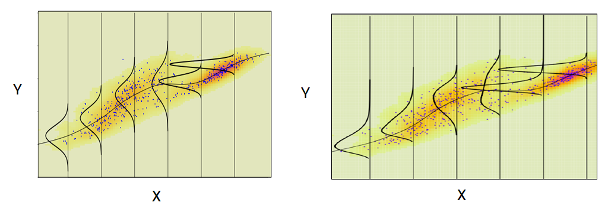

# Regresión lineal simple {#rls}
En este capítulo se presenta una descripción breve del modelo de regresión lineal simple y la forma de estimar los parámetros del modelo con R.

## Modelo estadístico {-}
El modelo estadístico en regresión lineal simple se puede escribir de dos formas como se muestra a continuación.

1. En esta forma la variable respuesta $y$ se expresa como una suma de $\beta_0 + \beta_1 x_i$ y un error aleatorio $e_i$ el cual tiene distribución $N(0, \sigma^2)$. El modelo en esta forma se puede expresar como sigue.

\begin{align} \label{mod1}
Y_i &= \beta_0 + \beta_1X_i + e_i,\\ 
e_i &\sim N(0, \sigma^2)
\end{align}

2. En esta forma la variable respuesta $y$ tiene distribución normal con media que cambia en función de la variable $x$ pero con varianza constante. El modelo en esta forma se puede expresar como sigue.

\begin{align} \label{mod2}
Y_i &\sim N(\mu_i, \sigma^2), \\ 
\mu_i &= \beta_0 + \beta_1 X_i, \\
\sigma^2 &= \text{constante}
\end{align}

En cualquiera de las dos formas el vector de parámetros del modelo es $\boldsymbol{\theta}=(\beta_0, \beta_1, \sigma)^\top$. Para estimar este vector de parámetros se suelen utilizar dos métodos: [mínimos cuadrados](#apend11) o [máxima verosimilitud](#apend12).

La siguiente figura es tomada del libro [@neter2005] muestra con claridad el supuesto de normalidad de la variable $Y$, la dependencia de la media $\mu$ con $X$ y la varianza constante.

<p align="center">
  
</p>

En la siguiente figura se muestran dos ilustraciones para donde los supuestos no se cumplen.

<p align="center">
  
</p>

## Función `lm` {-}
La función `lm` de R se usa para ajustar un modelo de regresión lineal simple, la estructura de esta función se muestra a continuación.

```{r, eval=FALSE}
lm(formula, data, subset, weights, na.action,
   method = "qr", model = TRUE, x = FALSE, y = FALSE, qr = TRUE,
   singular.ok = TRUE, contrasts = NULL, offset, ...)
```

A continuación se presenta una corta descripción de los parámetros más usados en la función.

- `formula`: es un objeto de la clase fórmula para indicar la variable respuesta y las covariables. Por ejemplo, si `formula = y ~ x1 + x2` lo que se indica es que la variable respuesta es `y`, las covariables serían `x1` y `x2`.
- `data`: es el marco de datos donde se buscarán las variables usadas en la fórmula. Si este parámetro queda vacío, R buscará las variables en el ambiente global.

### Ejemplo {-}
Como ilustración vamos a usar los datos del ejemplo 2.1 del libro de [Montgomery, Peck and Vining (2003)](https://www.amazon.com/Introduccion-analisis-regresion-lineal-Spanish/dp/9702403278). En el ejemplo 2.1 los autores desean ajustar un modelo de regresión lineal simple para explicar la Resistencia de una soldadura en función de la Edad de la soldadura.

<p align="center">
  
</p>

__Solución__

A continuación el código para cargar los datos y para mostrar las 6 primeras observaciones de la base de datos, en total tenemos 20 observaciones.

```{r}
file <- "https://raw.githubusercontent.com/fhernanb/datos/master/propelente"
datos <- read.table(file=file, header=TRUE)
head(datos) # shows the first 6 rows
```

Para crear un diagrama de dispersión que nos muestre la relación entre las dos variables usamos las siguientes instrucciones.

```{r soldadura1, fig.height=3, fig.width=5, fig.align='center', message=FALSE}
library(ggplot2)
ggplot(datos, aes(x=Edad, y=Resistencia)) + 
  geom_point() + theme_light()
```

De la figura anterior se ve claramente que a medida que aumenta la edad de la soldadura, la resistencia que ella ofrece disminuye. Adicionalmente, se observa que la relación entre las variables es lineal con una dispersión que parece constante.

El modelo que se va a ajustar se muestra a continuación.

\begin{align}
Resistencia_i &\sim N(\mu_i, \sigma^2), \\ 
\mu_i &= \beta_0 + \beta_1 Edad_i, \\
\sigma^2 &= \text{constante}
\end{align}

Para obtener las estimaciones de los parámetros del modelo anterior se usa el código mostrado abajo. La función `lm` se aplica con la fórmula `Resistencia ~ Edad` para indicar que Resistencia es la variable respuesta y que Edad es la variable explicativa. Los resultados del la función `lm` se almacenan en el objeto `mod1` para luego poder usar el modelo ajustado. La segunda línea del código mostrado abajo se usa para mostrar por pantalla un reporte sencillo del modelo ajustado.

```{r}
mod1 <- lm(Resistencia ~ Edad, data=datos)
mod1 # Para imprimir el objeto mod1
```

En la salida anterior se observan los valores estimados de $\beta_0$ y $\beta_1$ pero no aparece la estimación de $\sigma$. Para obtener una tabla de resumen con detalles del modelo ajustado, se usa la función genérica `summary`, a continuación el código necesario para obtener la tabla.

```{r, eval=FALSE}
summary(mod1)
```

La siguiente figura muestra el resultado del código anterior. En la figura se resalta la información sobre los residuales y las estimaciones de $\beta_0$, $\beta_1$ y $\sigma$.

```{r summary01, echo=F, fig.cap='Tabla de resumen para un modelo lineal.', dpi=80, fig.align='center'}
knitr::include_graphics("images/summary01.png")
```

Con los resultados anteriores se puede expresar el modelo ajustado como se muestra a continuación.

\begin{align}
\widehat{Resistencia}_i &\sim N(\hat{\mu}_i, \hat{\sigma}^2), \\ 
\hat{\mu}_i &= 2627.822 -37.154 \, Edad_i, \\
\hat{\sigma} &= 96.11
\end{align}

```{block2, type='rmdnote'}
¿Cómo se pueden interpretar los efectos $\hat{\beta}$?
  
- Por cada semana que envejezca la soldadura, se espera que la __resistencia promedio__ disminuya en 37.154 psi.
- Si la soldadura es nueva ($Edad =0$), se espera que la __resistencia promedio__ sea de 2627.822 psi.
```

Para incluir la recta de regresión que representa el modelo ajustado anterior se puede usar el siguiente código.

```{r soldadura2, fig.height=3, fig.width=5, fig.align='center'}
ggplot(datos, aes(x=Edad, y=Resistencia)) + 
  geom_point() +
  geom_smooth(method='lm', formula=y~x, se=FALSE, col='dodgerblue1') +
  theme_light()
```

## Clase `lm` {-}
Todo objeto creado con la función `lm( )` es de la clase **lm**, para verificar esto podemos escribir lo siguiente en la consola.

```{r}
class(mod1)
```

Dentro de todo objeto de la clase **lm** hay doce elementos o valores que se pueden utilizar. A continuación se muestra el código para saber los nombres de esos elementos.

```{r}
names(mod1)
```

Cualquiera de los anteriores elementos se pueden extraer usando el operador `$` entre el objeto y el elemento, por ejemplo, para extraer los coeficientes estimados se escribe lo siguiente:

```{r}
mod1$coefficients
```

Los nombres de los elementos dan una idea clara de lo que ellos almacenan, si el lector quiere más detalles sobre los elementos, sólo debe solicitar la ayuda de la función con `help(lm)` y en la sección de __Value__ encontrará la información.

En el siguiente código se utiliza para extraer el elemento `$fitted.value` que contiene los valores predichos o ajustados $\hat{y}_i$.

```{r}
mod1$fitted.values
```

A continuación se muestra el código para extraer el elemento `$residuals` que contiene los residuales usuales $\widehat{e}_i= Y_i - \widehat{Y}_i$.

```{r}
mod1$residuals
```

```{block2, type='rmdnote'}
Los valores ajustados y los residuales también se pueden recuperar usando las funciones `fitted( )` y `residuals( )`. Consulte la ayuda de estas funciones para conocer otros detalles.
```

### Ejemplo {-}
Aquí se retoma el ejemplo de Resistencia en función de la Edad. El objetivo es crear una diagrama de dispersión con los puntos originales $(X_i, Y_i)$, las estimaciones $\widehat{Y}_i$ y los residuales $\widehat{e}_i$.

Lo primero que se debe hacer es agregar a los datos originales el vector con las estimaciones $\hat{y}_i$, el código necesario se muestra a continuación.

```{r}
datos$predicciones <- predict(mod1)
```

En el diagrama dispersión los puntos originales $(X_i, Y_i)$ estarán en color negro y los puntos correspondientes a las estimaciones $(X_i, \hat{Y}_i)$ estarán en color rojo, estos últimos coincidirán con la recta estimada en color gris. Los residuales $e_i$ se mostrarán como líneas a trazos de color rojo. El código necesario se muestra a continuación.

```{r soldadura3, fig.height=3, fig.width=5, fig.align='center'}
ggplot(datos, aes(x=Edad, y=Resistencia)) +
  geom_smooth(method="lm", se=FALSE, color="lightgrey") +
  geom_segment(aes(xend=Edad, yend=predicciones), col='red', lty='dashed') +
  geom_point() +
  geom_point(aes(y=predicciones), col='red') +
  theme_light()
```

## Mínimos cuadrados ponderados {-}
Los mínimos cuadrados ponderados son una generalización de los mínimos cuadrados ordinarios y se usan para hacer una regresión en la cual las observaciones tienen diferente peso o importancia en el modelo.

### Ejemplo {-}
Use la información de las siguientes variables y ajuste dos modelos de regresión, uno sin usar los pesos `w` y otro usando los pesos. Luego dibuje en una misma figura las rectas o modelos ajustados.

```{r}
x <- c(4, 6, 8, 7, 8, 5)
y <- c(1, 2, 3, 4, 5, 4)
w <- c(0.1, 0.1, 0.2, 0.1, 0.2, 0.9)
```

__Solución__

Vamos a ajustar los modelos de la siguiente manera.

```{r}
mod_sin_pesos <- lm(y ~ x)
mod_con_pesos <- lm(y ~ x, weights=w)
```

Ahora vamos a explorar los coefientes.

```{r}
coef(mod_sin_pesos)
coef(mod_con_pesos)
```

A continuación se muestra el código para construir el diagrama de dispersión usando la función `symbols`. La información de la importancia de cada observación se incluye en el dibujo usando `circles=w`. Finalmente se agregan las rectas de los dos modelos ajustados.

```{r fig.height=4, fig.width=4, fig.align='center'}
symbols(x=x, y=y, circles=w, pch=20, las=1, inches=0.2, fg='red')
abline(mod_sin_pesos, col='seagreen')
abline(mod_con_pesos, col='dodgerblue1')
legend('topleft', legend=c('Sin pesos', 'Con pesos'), 
       col=c('seagreen', 'dodgerblue1'), bty='n', lwd=1)
```

De la anterior figura podemos ver que los ajustes son muy diferentes. La recta de color azul tiene menor pendiente y un mayor punto de corte. Esta recta azul tiende a estar más cerca del punto (5, 3) porque este tiene un peso de 0.9, el mayor de todos los pesos. El efecto de este punto en el modelo es que él jala la recta de regresión hacia él debido a su gran peso de 0.9.

<p align="center">
  
</p>

## Apéndice {-}

### Estimación por mínimos cuadrados {#apend11}

Para estimar $\beta_0$ y $\beta_1$ utilizamos el método de mínimos cuadrados ordinarios, minimizando la suma  cuadrática del error:

\begin{eqnarray*}
S(\beta_0, \beta_1)&=&\sum_{i=1}^ne_i^2\\
&=&\sum_{i=1}^n(Y_i-\beta_0-\beta_1X_i)^2
\end{eqnarray*}
Derivando e igualando a cero, es decir,
$$\frac{\partial S(\beta_0, \beta_1)}{\partial \beta_0}=0$$
$$\frac{\partial S(\beta_0, \beta_1)}{\partial \beta_1}=0$$
obtenemos que los estimadores para $\beta_0$ y $\beta_1$ están dados por
$$\widehat{\beta}_0=\overline{Y}-\widehat{\beta}_1\overline{X}\quad \text{y}\quad \widehat{\beta}_1=\frac{S_{xy}}{S_{xx}}$$
donde 
$S_{xx}=\sum_{i=1}^n(X_i-\overline{X})^2$ &	$S_{yy}=\sum_{i=1}^n(Y_i-\overline{Y})^2$ & $S_{xy}=S_{yx}=\sum_{i=1}^n(X_i-\overline{X})(Y_i-\overline{Y})$	 \\


### Estimación por máxima verosimilitud {#apend12}


Sabemos que para nuestro modelo de regresión lineal simple, 

$$Y_i\sim N\left(\beta_0+\beta_1X_i, \sigma^2\right),\quad \text{para todo $i=1, 2,  \ldots, n$}.$$
Y como los errores $e_1, e_2, \ldots, e_n$ son independientes, entonces $Y_1, Y_2, \ldots, Y_n$ también son independientes.

Así, la función de verosimilitud estaría dada por:
\begin{eqnarray*}
L\left(\beta_0, \beta_1, \sigma^2 | X_1, \ldots, X_n, Y_1, \ldots, Y_n \right)&=&\prod_{i=1}^n\frac{1}{\sqrt{2\pi\sigma^2}}\exp\left\{-\frac{1}{2\sigma^2}(Y_i-\beta_0-\beta_1X_i)^2\right\}\\
&=&\frac{1}{(2\pi\sigma^2)^{n/2}}\exp\left\{-\frac{1}{2\sigma^2}\sum_{i=1}^n(Y_i-\beta_0-\beta_1X_i)^2\right\}
\end{eqnarray*}
Tomando logaritmo natural a ambos lados y denotando la log-verosimilitud por
$$\ln \left[L\left(\beta_0, \beta_1, \sigma^2 | X_1, \ldots, X_n, Y_1, \ldots, Y_n \right)\right]=l\left(\beta_0, \beta_1, \sigma^2 | X_1, \ldots, X_n, Y_1, \ldots, Y_n \right),$$
tenemos que
\begin{eqnarray*}
l\left(\beta_0, \beta_1, \sigma^2 | X_1, \ldots, X_n, Y_1, \ldots, Y_n \right)
&=&-\left(\frac{n}{2}\right)\ln(2\pi)-\left(\frac{n}{2}\right)\ln\left(\sigma^2\right)-\left(\frac{1}{2\sigma^2}\right)\sum_{i=1}^n(Y_i-\beta_0-\beta_1X_i)^2
\end{eqnarray*}
Derivando parcialmente con respecto a $\beta_0$, $\beta_1$ y $\sigma^2$ e igualando a cero, obtenemos los estimadores de máxima verosimilitud:
$$\widetilde{\beta}_0=\overline{Y}-\widetilde{\beta}_1\overline{X}$$
$$\widetilde{\beta}_1=\frac{S_{xy}}{S_{xx}}$$
$$\widetilde{\sigma}^2=\frac{\sum_{i=1}^n(Y_i-\widetilde{\beta}_0-\widetilde{\beta}_1X_i)^2}{n}.$$
\textbf{Nota:} Los estimadores de máxima verosimilitud para regresión lineal simple, pueden ser obtenidos mediante la optimización directa de la función de log-verosimilitud.

