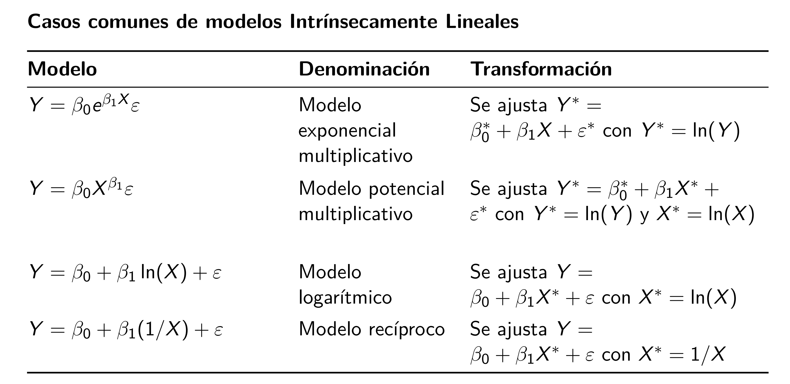
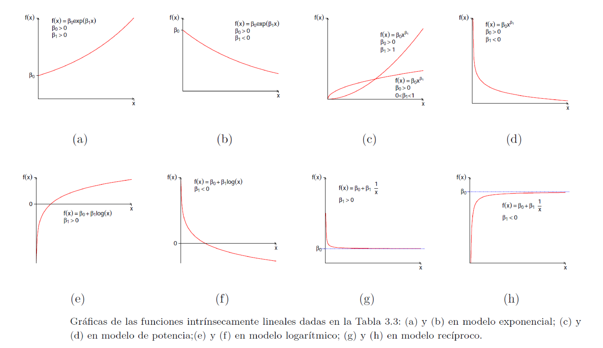

# Transformaciones {#trans}
En este capítulo se muestra cómo una transformación de la variable respuesta o de las covariables puede mejorar el modelo.

## Transformaciones para linealizar el modelo {-}
En algunas ocasiones el modelo teórico de los datos tiene una estructura matemática que puede ser linealizable al transformar $Y$ y/o $X$. En la siguiente tabla se muestran algunos de los casos en los cuales se puede linealizar el modelo.

<p align="center">
  
</p>

En la siguiente figura se muestran los patrones de los modelos que se pueden linealizar.

<p align="center">
  
</p>

### Ejemplo {-}
Este ejemplo está basado en el ejericio 5.1 propuesto en el libro @mpv06 se presenta una base de datos de un estudio de cómo influye la temperatura (°C) sobre la viscosidad (mPa s) de las mezclas de tolueno y tetralina. La base de datos cuenta con un total de 50 observaciones, a continuación se muestran las primeras seis observaciones de la base.

```{r echo=FALSE}
n <- 100
set.seed(124356)
temp <- runif(n=n, min=24.9, max=95.2)
set.seed(12345)
error <- rnorm(n=n, sd=0.01)
visc <- 1.44 * exp(-0.02 * temp) + error
datos <- data.frame(temp=temp, visc=visc)
datos <- round(datos, digits=2)
head(datos)
```

a. Crear un diagrama de dispersión. ¿Parece apropiado usar una línea recta para modelar los datos?
b. Ajuste el modelo de línea recta. Calcule las estadísticas resumidas y las gráficas residuales. ¿Cuáles son sus conclusiones sobre la adecuación del modelo?
c. Los principios básicos de la química física sugieren que la viscosidad es una función exponencial de la temperatura. Repita la parte b usando la transformación adecuada según esta información.
d. ¿Cuál modelo se debería usar? Escriba la ecuación del modelo.
e. Con el modelo elegido, calcule $\widehat{Visco}$ para $Temp=0$ y para $Temp=50$.

__Solución__

a. Diagrama de dispersión

```{r transf01, fig.height=4, fig.width=5, fig.align='center', message=FALSE}
library(ggplot2)
ggplot(datos, aes(x=temp, y=visc)) + 
  geom_point() + theme_light() +
  xlim(0, 120) + 
  labs(y="Viscocidad (mPa s)", x="Temperatura (°C)")
```


b. Ajustando el modelo de línea recta. 

```{r}
m1 <- lm(visc ~ temp, data=datos)
```

Los estadísticos de resumen se obtiene así:

```{r}
summary(m1)
```

De la tabla anterior se observa que:

- La temperatura es significativa porque valor-p es < 2e-16.
- Por cada grado °C en que aumente la temperatura, la viscocidad disminuye en 0.00928098 unidades.
- El $R^2$ es alto, presenta un valor de 0.9701.
- El modelo m1 es significativo porque valor-p es < 2.2e-16.

Para ver los residuales del modelo se hace lo siguiente:

```{r transf02, fig.height=6, fig.width=6, fig.align='center'}
par(mfrow=c(2, 2))
plot(m1, las=1, col='purple', which=1:3, cex=1.5, pch=19)
```

Claramente los residuales muestran un patrón de u, eso indica que hay algo errado con el modelo m1.

```{r}
res_m1 <- residuals(m1)
shapiro.test(res_m1)
```

c. Vamos a entrenar un modelo asumiendo un patrón exponencial multiplicativo $Y = \beta_0 e^{\beta_1X}\varepsilon$. 

Para poder ajustar este modelo en R, es necesario transformar la variable respuesta, es decir, vamos a entrenar con $Y^*=\log(Y)$. En otras palabras, vamos a aplicar $\log()$ a ambos lados del modelo exponencial multiplicativo $Y = \beta_0 e^{\beta_1X}\varepsilon$ y lo que obtiene es:

$$
Y^* = \beta_0^* + \beta_1 X + \varepsilon^*,
$$

donde el nuevo intercepto es $\beta_0^*=\log(\beta_0)$ y el nuevo error es $\varepsilon^*=\log(\varepsilon)$. El valor de $\beta_1$ es el mismo en el modelo original y en el modelo transformado.

```{block2, type="rmdwarning"}
Al ajustar el modelo transformado vamos a obtener un intercepto estimado $\hat{\beta}_0^*$ y una pendiente estimada $\hat{\beta}_1$.

Si queremos obtener $\hat{\beta}_0$, debemos despejar de la ecuación $\beta_0^*=\log(\beta_0)$ el valor de $\hat{\beta}_0$.
```

Ajustemos el modelo m2.

```{r}
m2 <- lm(log(visc) ~ temp, data=datos)
```

Los estadísticos de resumen se obtiene así:

```{r}
summary(m2)
```

De la tabla anterior se observa que:

- La temperatura es significativa porque valor-p es < 2e-16.
- Por cada grado °C en que aumente la temperatura, la **log(viscocidad)** disminuye en 0.0199453 unidades.
- El $R^2$ es alto, presenta un valor de 0.9938.
- El modelo m2 es significativo porque valor-p es < 2.2e-16.

Para ver los residuales del modelo se hace lo siguiente:

```{r transf03, fig.height=6, fig.width=6, fig.align='center'}
par(mfrow=c(2, 2))
plot(m2, las=1, col='palegreen3', which=1:3, cex=1.5, pch=19)
```


```{r}
res_m2 <- residuals(m2)
shapiro.test(res_m2)
```

Comparemos las líneas o modejos ajustados m1 y m2 con un diagrama de dispersión.

```{r transf04, fig.height=4.5, fig.width=8, fig.align='center'}
par(mfrow=c(1, 2))

plot(x=datos$temp, y=datos$visc, pch=20, cex=0.8,
     xlab="Temperatura (°C)", ylab="Viscocidad", main="M1")
abline(m1, col="purple", lwd=2)

plot(x=datos$temp, y=log(datos$visc), pch=20, cex=0.8,
     xlab="Temperatura (°C)", ylab="log(Viscocidad)", main="M2")
abline(m2, col="palegreen3", lwd=2)
```

d. ¿Cuál modelo se debería usar? Escriba la ecuación del modelo.

Usando los resultados de summary de m2 es posible escribir la ecuación ajustada para el modelo modelo transformado y para el modelo exponencial multiplicativo.  

Modelo transformado:

$$
\widehat{Visco^*} = \widehat{\log(Visco)} = 0.3657 - 0.0199 \, Temp,
$$

Modelo exponencial multiplicativo:

$$
\widehat{Visco} = 1.4415 \, e^{- 0.0199 \, Temp},
$$

donde $1.4415=\exp(0.3657)$.

e. Con el modelo elegido, calcule $\widehat{Visco}$ para $Temp=0$ y para $Temp=50$.

- La cantidad $\widehat{Visco} \vert Temp=0$ no se debe calcular.
- La cantidad $\widehat{Visco} \vert Temp=50$ es $1.4415 \, e^{- 0.0199 \times 50} = 0.5330$.

```{r transf05, fig.height=4, fig.width=5, fig.align='center'}
visco_hat <- function(x) 1.4415 * exp(-0.0199*x)

plot(x=datos$temp, y=datos$visc, pch=20, cex=0.8,
     xlab="Temperatura (°C)", ylab="Viscocidad", 
     main="Modelo final")

curve(expr=visco_hat(x), add=TRUE, col="tomato")
```

