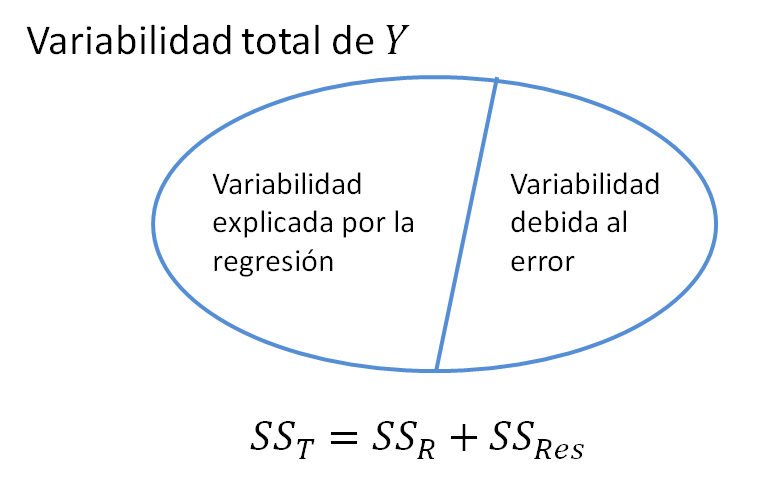
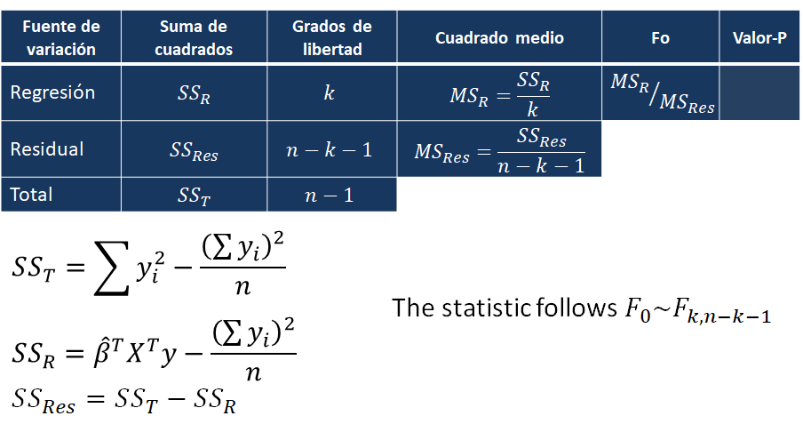
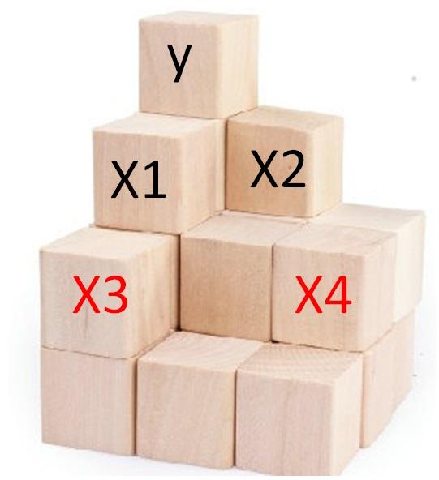

# Pruebas de significancia {#ph2}

En este capítulo se muestra como realizar pruebas de significancia en un modelo de regresión. Las pruebas explicadas son las siguientes:

- Prueba sobre todos los coeficientes (prueba de significancia de la regresión).
- Prueba para comparar modelos anidados (prueba parcial F).

## Prueba sobre todos los coeficientes {-}
Supongamos que tenemos un modelo de regresión múltiple como se muestra a continuación.

\begin{align}
y_i &\sim N(\mu_i, \sigma^2), \\ 
\mu_i &= \beta_0 + \beta_1 x_{1i} + \beta_2 x_{2i} + \cdots + \beta_k x_{ki}, \\
\sigma^2 &= \text{constante}
\end{align}

Para este modelo nos podemos preguntar si __alguna__ de las covariables aporta información al modelo o si __ninguna__ aporta información al modelo. Esta duda se puede resumir simbólicamente por medio del siguiente conjunto de hipótesis.

\begin{align}
H_0 &: \beta_1=\beta_2=\ldots=\beta_k=0 \\ 
H_1 &= \text{al menos uno de los} \, \beta_j\neq0 \, \text{con} \, j=1,2,\ldots,k,
\end{align}

La prueba para analizar las hipótesis anteriores se llama __prueba de significancia de la regresión__. 

En todo modelo de regresión vamos a tener una variabilidad Total ($SS_T$), una variabilidad explicada por el modelo de Regresión ($SS_R$) y una variabilidad Residual ($SS_{Res}$) que no logra ser explicada por el modelo, abajo una figura ilustrativa de las tres variabilidades.

<p align="center">
  
</p>

En esta prueba la idea es determinar si la variabilidad explicada por la Regresión ($SS_R$) es una parte considerable de la variabilidad Total ($SS_T$) o no. Para realizar esta prueba se construye la tabla anova (analysis of variance) tal como se muestra a continuación.

<p align="center">
  
</p>

Asumiendo $H_0$ verdadera, la distribución del estadístico $F_0$ es $F_{k, n-k-1}$.

### Ejemplo {-}
Como ilustración vamos a usar los datos del ejemplo 3.1 del libro de [@mpv06]. En el ejemplo 3.1 los autores ajustaron un modelo de regresión lineal múltiple para explicar el __Tiempo__ necesario para que un trabajador haga el mantenimiento y surta una máquina dispensadora de refrescos en función de las variables __Número de Cajas__ y __Distancia__. 

¿Será que las variables __Número de Cajas__ y __Distancia__ son significativas en el modelo?

<p align="center">
  
</p>

__Solución__

En este problema nos interesa estudiar el siguiente conjunto de hipótesis.

\begin{align}
H_0 &: \beta_{cant}=\beta_{dis}=0 \\ 
H_1 &= \text{al menos uno de los coefiencientes} \, \beta_{cant} \, \text{o} \, \beta_{dis} \, \text{es diferente de cero}
\end{align}

Para responder esta pregunta vamos a aplicar la prueba de significancia de la regresión. Lo primero que se debe hacer es ajustar el modelo.

```{r, message=FALSE}
require(MPV)
colnames(softdrink) <- c('tiempo', 'cantidad', 'distancia')
mod <- lm(tiempo ~ cantidad + distancia, data=softdrink, x=TRUE)
```

Luego de ajustar el modelo debemos calcular los elementos de la tabla anova, para eso usamos el siguiente código.

```{r}
y <- softdrink$tiempo
n <- length(y)
ss_t <- sum(y^2) - sum(y)^2 / n
ss_r <- matrix(coef(mod), nrow=1) %*% t(mod$x) %*% matrix(y, ncol=1) - sum(y)^2 / n
ss_res <- ss_t - ss_r
ms_r <- ss_r / (length(coef(mod))-1)
ms_res <- ss_res / (n-length(coef(mod)))
F0 <- ms_r / ms_res
valorP <- pf(F0, df1=length(coef(mod))-1, df2=(n-length(coef(mod))), lower.tail=FALSE)
tabla <- matrix(NA, ncol=5, nrow=3)
tabla[1, ] <- c(ss_r, length(coef(mod))-1, ms_r, F0, valorP)
tabla[2, 1:3] <- c(ss_res, n-length(coef(mod)), ms_res)
tabla[3, 1:2] <- c(ss_t, n-1)
colnames(tabla) <- c('Suma Cuadrados', 'gl', 'Cuadrado medio', 'F0', 'Valor-P')
rownames(tabla) <- c('Reg', 'Resid', 'Total')
tabla
```

De la tabla anterior se observa que el valor-P es muy pequeño por lo tanto hay evidencias para rechazar $H_0: \beta_{cant}=\beta_{dis}=0$, eso significa que al menos una (o ambas) de las variables si ayudan a explicar la media de la variable respuesta.

Otra forma de aplicar la prueba de significancia de la regresión es usando la función `summary` la cual nos entrega una parte de la tabla anova anterior (no toda la tabla anova).

```{r}
summary(mod)
```

En la última línea de la salida anterior tenemos la información de la prueba de hipótesis sobre significancia de la regresión. El valor-P de esta prueba es 4.687e-16 y por lo tanto podemos rechazar $H_0$ a un nivel de significancia usual del 5%, eso significa que al menos una de las dos covariables del modelo es significativa para explicar el tiempo medio.

```{block2, type='rmdnote'}
El no rechazar $H_0: \beta_1 = \beta_2 = \ldots = \beta_p = 0$ significa que ninguna de las variables aporta información para explicar la media de $Y$. Lo que se debe hacer luego es buscar nuevas covariables que sean significativas.
```

```{block2, type='rmdnote'}
El rechazar $H_0: \beta_1 = \beta_2 = \ldots = \beta_p = 0$ significa que una, o dos, o tres, o cuatro, ..., o que todas las $p$ covariables son significativas. Pero, ¿cómo saber cuales variables son significativas?
```

## Prueba para comparar modelos anidados {-}
Esta prueba se usa para comparar modelos que comparten una estructura anidada. 

A continuación se muestran dos modelos (reducido y completo) anidados a manera de ilustración.

Modelo reducido
\begin{align}
y_i &\sim N(\mu_i, \sigma^2), \\ 
\mu_i &= \beta_0 + \beta_1 x_{1i} + \beta_2 x_{2i}, \\
\sigma^2 &= \text{constante}
\end{align}

Modelo completo
\begin{align}
y_i &\sim N(\mu_i, \sigma^2), \\ 
\mu_i &= \beta_0 + \beta_1 x_{1i} + \beta_2 x_{2i} + \beta_3 x_{3i} + \beta_4 x_{4i}, \\
\sigma^2 &= \text{constante}
\end{align}

La pregunta que surge aquí es: ¿vale la pena incluir las variables $x_3$ y $x_4$ simultáneamente al modelo reducido? ¿esas variables mejoran el modelo reducido? ¿será mejor el modelo reducido o el modelo completo?

Los interrogantes anteriores se pueden resumir simbólicamente así:

\begin{align}
H_0 &: \beta_3=\beta_4=0 \\ 
H_1 &= \text{al menos uno de los coefiencientes} \, \beta_{3} \, \text{o} \, \beta_{4} \, \text{es diferente de cero}
\end{align}

Para realizar esta prueba se usa el siguiente estadístico

$$
F_0 = \frac{\frac{SS_R(complete) - SS_R(reduced)}{p_1-p_0}}{MS_{Res}},
$$
donde $SS_R(complete)$ es la suma de cuadrados de la regresión para el modelo completo, $SS_R(reduced)$ es la suma de cuadrados de la regresión para el modelo reducido, $p_1$ es el número de $\beta$'s en el modelo completo, $p_0$ es el número de $\beta$'s en el modelo reducido y $MS_{Res}$ es la estimación de $\sigma^2$ en el modelo completo. La distribución del estadístico $F_0$ es:

- $F_{p_1-p_0, n-p_1}$ si $H_0$ es cierta.
- $F_{p_1-p_0, n-p_1, \lambda}$ si $H_1$ es cierta, siendo $\lambda$ el parámetro de no centralidad de una distribución F.

Para conocer la expresión de $\lambda$ se recomienda revisar la página 90 de [@Montgomery12] y los comentarios al respecto.

### Ejemplo {-}
Usando la base de datos `table.b4` del paquete **MPV** [@R-MPV], queremos comparar dos modelos anidados:

- el modelo reducido con la fórmula `y ~ x1 + x2`,
- y el modelo completo con la fórmula `y ~ x1 + x2 + x3 + x4`. 

¿Será que la inclusión simultánea de las variables `x3` y `x4` mejora el modelo para explicar la variable respuesta `y`? Use $\alpha=0.03$ para concluir.

<p align="center">
  
</p>

__Solución__

Primero veamos los datos.

```{r}
require(MPV)
data(table.b4) 
head(table.b4, n=4)
```

Ajustemos los dos modelos de interés.

```{r}
redu_mod <- lm(y ~ x1 + x2, data=table.b4, x=TRUE)
comp_mod <- lm(y ~ x1 + x2 + x3 + x4, data=table.b4, x=TRUE)
```

En este ejercicio nos interesa estudiar el siguiente conjunto de hipótesis.

\begin{align}
H_0 &: \beta_3 = \beta_4 = 0 \\ 
H_1 &= \text{al menos uno de los coefiencientes} \, \beta_{3} \, \text{o} \, \beta_{4} \, \text{es diferente de cero}
\end{align}

Ahora construyamos el estadístico $F_0$.

```{r}
n <- 24 # numero de observaciones
p0 <- 3 # numero de betas en modelo reducido
p1 <- 5 # numero de betas en modelo completo

ssr_reduced  <- sum(table.b4$y) - sum(redu_mod$residuals^2)
ssr_complete <- sum(table.b4$y) - sum(comp_mod$residuals^2)
ms_res <- summary(comp_mod)$sigma^2
F0 <- ((ssr_complete - ssr_reduced) / (p1-p0)) / ms_res
F0
```

Ahora vamos a calcular el parámetro de no centralidad $\lambda$. Recuerde revisar la página 90 de [@Montgomery12] para conocer su expresión.

```{r}
beta2 <- matrix(c(0.3233333, -0.2176622), ncol=1)
x1 <- comp_mod$x[, 1:3]
x2 <- comp_mod$x[, 4:5]
a1 <- t(beta2) %*% t(x2)
a2 <- diag(n) - x1 %*% solve(t(x1) %*% x1) %*% t(x1)
a3 <- x2 %*% beta2
lambda <- (a1 %*% a2 %*% a3) / summary(comp_mod)$sigma^2
lambda
```

Ahora vamos a calcular el valor-P de la prueba usando la distribución F no central y la distribució F (usual) así:

```{r}
pf(q=F0, df1=p1-p0, df2=n-p1, ncp=lambda, lower.tail=FALSE)
pf(q=F0, df1=p1-p0, df2=n-p1, lower.tail=FALSE)
```

Usando el último valor-P que es mayor que un nivel de significancia $\alpha$, no hay evidencias para rechazar $H_0: \beta_3 = \beta_4 = 0$, y por lo tanto podemos concluir que las variables `x3` y `x4` no mejoran el modelo.

## Función `anova` {-}
La función `anova` permite realizar pruebas de hipótesis como las mostradas en las secciones anteriores, en particular la función sirve para:

- comparar secuencialmente las variables de un modelo.
- comparar modelos anidados. 

El método S3 `anova.lm` (o simplemente `anova`) tiene la estructura mostrada a continuación.

```{r, eval=FALSE}
anova(object, test, scale=0)
```

Los argumentos de esta función son:

- `object`: un objeto de la clase `lm`.
- `test`: una cadena de caracteres indicando el tipo de prueba, `F`, `Chisq` o `Cp`, el valor por defecto es `F`.
- `scale`: valor de la estimación de $\sigma^2$. Cuando es igual a cero se usa el estimador del modelo con más parámetros (`m2`).

```{block2, type='rmdnote'}
La función `anova` se puede aplicar a un solo modelo y el resultado será una prueba de hipótesis secuencial en las variables.

La función `anova` se puede aplicar a varios modelos y el resultado será una comparación de modelos.
```

A continuación se muestran dos ejemplos en los cuales se ilustra la utilidad de la función `anova`.

### Ejemplo {-}
En este ejemplo se mostrará la segunda utilidad de la función `anova`. Para esto vamos a utilizar la base de datos `Cars93` del paquete `MASS`. El objetivo es construir un modelo para explicar la media del `Price` de los autos en función de las variables `Horsepower`, `Type` y `Weight`.

<p align="center">
  
</p>

__Solución__

La solución de este ejercicio tendrá dos partes, en la primera se construirán varios modelos, iniciando con uno sin covariables (`mod0`) hasta uno con todas las covariables (`mod3`). En la segunda parte se analizará el modelo con todas las covariables directamente.

A continuación el código para crear y comparar los modelos sin covariables y el modelo con solo `Horsepower`.

```{r message=FALSE}
library(MASS)
mod0 <- lm(Price ~ 1, data=Cars93)
mod1 <- lm(Price ~ Horsepower, data=Cars93)
anova(mod0, mod1)
```

De la salida anterior se tiene que el valor-P es < 2.2e-16 y por lo tanto se concluye que la variable `Horsepower` mejora el modelo (la misma conclusión se pudo obtener del `summary`).

Ahora vamos a crear y comparar el modelo con sólo `Horsepower` con el modelo con `Horsepower` y `Type`.

```{r}
mod2 <- lm(Price ~ Horsepower + Type, data=Cars93)
anova(mod1, mod2)
```

De la salida anterior se tiene que el valor-P es 0.01337 y por lo tanto se concluye que el modelo `mod2` con dos covariables explica mejor la variable `Price`.

Ahora vamos a crear y comparar el modelo con `Horsepower` y `Type` con el modelo con las tres covariables.

```{r}
mod3 <- lm(Price ~ Horsepower + Type + Weight, data=Cars93)
anova(mod2, mod3)
```

De esta última salida vemos que el valor-P es 0.648, esto indica que la inclusión de la variable `Weight` no mejora el modelo `mod2` (la misma conclusión se pudo obtener del `summary`).

En esta segunda parte del ejemplo se usará la función `anova` directamente sobre el modelo completo `mod3`, a continuación los resultados.

```{r}
anova(mod3)
```

En la tabla anterior aparecen los resultados de una prueba de hipótesis secuencial a partir de la fórmula de `mod3`. La fórmula de `mod3` es `Price ~ Horsepower + Type + Weight`, por lo tanto en la primera línea de la tabla aparece la variable `Horsepower`, luego en la segunda aparece `Type` y así hasta la última variable `Weight`. El valor-P reportado en la primer línea es < 2e-16, esto indica el modelo con `Horsepower` es mejor que el modelo sin covariables; el valor-P de la segunda línea es 0.01411, esto indica que es mejor un modelo con las covariables `Horsepower` y `Type`; por último el valor-P de la tercer línea es 0.64803, esto indica que la variable `Weight` no mejora el modelo, es decir, que es mejor un modelo con solo `Horsepower` y `Type`.

### Ejemplo {-}
Usando la base de datos `table.b4` del paquete **MPV** [@R-MPV], queremos comparar dos modelos anidados:

- el modelo reducido con la fórmula `y ~ x1 + x2`,
- y el modelo completo con la fórmula `y ~ x1 + x2 + x3 + x4`. 

¿Será que la inclusión simultánea de las variables `x3` y `x4` mejora el modelo para explicar la variable respuesta `y`? Use $\alpha=0.03$ para concluir.

<p align="center">
  
</p>

__Solución__

Para este ejemplo vamos a usar los datos que se muestran a continuación.

```{r message=FALSE}
require(MPV)
data(table.b4) 
head(table.b4, n=4)
```

Ahora vamos a ajustar ambos modelos usando el siguiente código.

```{r}
mod1 <- lm(y ~ x1 + x2, data=table.b4)
mod2 <- lm(y ~ x1 + x2 + x3 + x4, data=table.b4)
```

El objetivo en este ejercicio analizar el siguiente conjunto de hipótesis.

$$H_0: \text{las variables x3 y x4 no mejoran el modelo},$$
$$H_A: \text{al menos una de ellas si mejora el modelo}$$

Para comparar los dos modelos usamos la siguiente instrucción.

```{r}
anova(mod1, mod2, test='F')
```

De la salida anterior se observa que el valor-P de la prueba es de 0.7565, usando un nivel de significancia del 5%, se concluye que la inclusión de las variables `x3` y `x4` no mejoran el modelo.

## `summary` versus `anova` {-}
La función `summary` permite evaluar el efecto de una variable asumiendo que las restantes variables siguen en el modelo, esto es llamado prueba de hipótesis marginal. Cuando se tiene una variable cualitativa (con $k$ niveles) dentro del modelo, ella aparecerá en la tabla del `summary` por medio de $k-1$ variables indicadoras y por lo tanto se tendrán $k-1$ valores-P asociados. Usar esos valores-P para decidir si una variable cualitativa es importante en el modelo puede ser engañoso, a continuación un ejemplo de esta situación.

### Ejemplo {-}
El ejemplo aquí mostrado está basado en una [pregunta](https://stats.stackexchange.com/questions/115304/interpreting-output-from-anova-when-using-lm-as-input) de StackOverFlow.

El ejemplo consiste en simular un conjunto de 30 valores de $y \sim N(\mu, 1)$, donde las observaciones 1 a 10 tienen $\mu=0$, las observaciones 11 a 20 tienen $\mu=-0.5$ y las restantes diez tienen $\mu=0.5$. Para diferenciar las observaciones se tendrá la variable de agruación cualitativa `g` que contendrá las letras A, B y C diez veces cada una. El código para simular los datos se muestra a continuación.

```{r}
set.seed(8867)  # this makes the example exactly reproducible
y <- c(rnorm(10, mean=0,    sd=1),
       rnorm(10, mean=-0.5, sd=1),
       rnorm(10, mean=0.5,  sd=1))
g <- rep(c("A", "B", "C"), each=10)
```

¿Será la variable cualitativa `g` significativa en un modelo de regresión?

__Solución__

Vamos a ajustar el modelo con fórmula `y ~ g` para estudiar el efecto de la agrupación `g` en la media de la variable respuesta `y`.

```{r}
model <- lm(y ~ g)
```

Obviamente esperamos concluir que la media de la variable `y` dependa de la variable de agrupación `g`. Para esto vamos a explorar el resultado con la función `summary`.

```{r}
summary(model)
```

De la salida anterior vemos que los efectos `gB` y `gC` tienen valores-P altos, superiores al usual 5%, y por lo tanto estaríamos tentados a decir que la variable `g` no tiene efecto sobre la media de `y`. El lector podría encontrar esto un poco desconcertante.

Vamos a realizar el análisis pero ahora con la función `anova`.

```{r}
anova(model)
```

En la fila donde aparece la variable `g` tenemos el resultado de la prueba de hipótesis

$$H_0: \text{la variable g no influye en la media de y},$$
$$H_A: \text{la variable g si influye en la media de y}$$

El valor-P de esta prueba es de 0.02583, esto indica que hay evidencias para rechazar $H_0$, es decir, encontramos que la variable `g` si influye sobre la media de la variable `y`.

```{block2, type='rmdtip'}
Cuando se quiera explorar el efecto de una variable cualitativa en un modelo es mejor usar la función `anova` que los resultados del `summary`.
```

## Prueba razón de verosimilitud {-}
Esta prueba evalúa la bondad de ajuste de dos modelos estadísticos competitivos en función de la razón de sus verosimilitudes, específicamente uno encontrado por maximización en todo el espacio de parámetros y otro encontrado después de imponer alguna restricción ($H_0$).

El estadístico de la prueba razón de verosimilitud se muestra a continuación.

$$
\lambda = -2 \log \left[ \frac{L(\Theta_0)}{L(\Theta)} \right] = -2 \left[ l(\Theta_0)-l(\Theta) \right],
$$

donde $L$ representa el valor de la verosimilitud y $l$ el valor de log-verosimilitud. Bajo la hipótesis nula, $\lambda \sim \chi^2_{k}$ donde $k$ es la diferencia entre el número de parámetros de los modelos comparados.

### Ejemplo {-}
Usando la base de datos `table.b4` del paquete **MPV** [@R-MPV], queremos comparar dos modelos anidados:

- el modelo reducido con la fórmula `y ~ x1 + x2`,
- y el modelo completo con la fórmula `y ~ x1 + x2 + x3 + x4`. 

¿Será que la inclusión simultánea de las variables `x3` y `x4` mejora el modelo para explicar la variable respuesta `y`? Use $\alpha=0.03$ para concluir.

__Solución__

Para este ejemplo vamos a usar los datos que se muestran a continuación.

```{r message=FALSE}
require(MPV)
data(table.b4) 
head(table.b4, n=4)
```

Ahora vamos a ajustar ambos modelos usando el siguiente código.

```{r}
mod0 <- lm(y ~ x1 + x2, data=table.b4)
mod1 <- lm(y ~ x1 + x2 + x3 + x4, data=table.b4)
```

El objetivo en este ejercicio analizar el siguiente conjunto de hipótesis.

$$H_0: \text{las variables x3 y x4 no mejoran el modelo},$$
$$H_A: \text{al menos una de ellas si mejora el modelo}$$

Para aplicar la prueba razón de verosimilitud usamos el siguiente código. Los grados de libertad en esta prueba son 2 porque esa es la diferencia entre el número de parámetros de los modelos.

```{r}
lambda <- -2 * (logLik(mod0) - logLik(mod1))
lambda
pchisq(q=lambda, df=2, lower.tail=FALSE)
```

Como el valor-P es grande, no hay evidencias para rechazar $H_0: \beta_3 = \beta_4 = 0$, y por lo tanto podemos concluir que las variables `x3` y `x4` no mejoran el modelo.

## Comparaciones múltiples {-}
En esta sección se muestra como utilizar el paquete __multcomp__ [@R-multcomp] que está basado en el libro "Multiple comparisons using R" [@bretz2010] para estudiar pruebas de hipótesis múltiples.

### Ejemplo {-}
Usando la base de datos `table.b4` del paquete **MPV** [@R-MPV], queremos ajustar el siguiente modelo:

\begin{align}
y_i &\sim N(\mu_i, \sigma^2), \\ 
\mu_i &= \beta_0 + \beta_1 x_{1i} + \beta_2 x_{2i} + \beta_3 x_{3i} + \beta_4 x_{4i}, \\
\sigma^2 &= \text{constante}
\end{align}

¿Será que la inclusión simultánea de las variables `x3` y `x4` mejora el modelo para explicar la variable respuesta `y`? Use $\alpha=0.03$ para concluir.

__Solución__

Lo primero que debemos hacer es ajustar el modelo de interés.

```{r}
require(MPV)
data(table.b4) 
mod <- lm(y ~ x1 + x2 + x3 + x4, data=table.b4)
coef(mod)
```

En este ejemplo nos interesa estudiar las siguientes dos hipótesis simultáneamente (no individualmente).

\begin{align*}
H_0 &: \beta_{3} = 0      &  H_0 &: \beta_{4} = 0 \\
H_A &: \beta_{3} \neq 0   &  H_A &: \beta_{4} \neq 0 
\end{align*}

Los dos conjuntos de hipótesis anteriores se pueden escribir matricialmente usando una matriz de constrate $\boldsymbol{C}$ que multiplica al vector de parámetros $\boldsymbol{\beta}$ y luego igualando es producto con el vector $\boldsymbol{a}=(0, 0)^\top$ que contiene lados derechos de las hipótesis anteriores.

$$
\boldsymbol{C} \boldsymbol{\beta} = 
\begin{pmatrix}
0 & 0 & 0 & 1 & 0 \\
0 & 0 & 0 & 0 & 1
\end{pmatrix}
\begin{pmatrix}
\beta_0 \\
\beta_1 \\
\beta_2 \\
\beta_3 \\
\beta_4 \\
\end{pmatrix} =
\begin{pmatrix}
\beta_3 \\
\beta_4 
\end{pmatrix}
$$

Teniendo definida la matriz $\boldsymbol{C}$, el vector $\boldsymbol{a}$ la prueba simultánea de las hipótesis se puede hacer de la siguiente manera.

```{r message=FALSE}
library(multcomp)
C <- matrix(c(0, 0, 0, 1, 0,
              0, 0, 0, 0, 1), ncol=5, byrow=TRUE)
mult_test <- glht(model=mod, linfct=C, alternative='two.sided', rhs=c(0, 0))
summary(mult_test, test = adjusted(type="single-step"))
```

De la salida anterior se obtiene que los dos valores-P "ajustados" (ver sección 2.1.2 de [@bretz2010]) son:

$$
q_1 = 0.704 \qquad q_2 = 0.998
$$

lo que significa que no hay evidencias para rechazar $H_0 : \beta_{3} = 0$ ni evidencias para rechazar $H_0 : \beta_{4} = 0$ porque ambos valores-P "ajustados" fueron mayores del nivel de significancia de 0.03. En otras palabras, ni `x3` ni `x4` aportan información para explicar la media de `y`.

```{block2, type='rmdwarning'}
Si un valor-P "ajustado" es menor que el $\alpha$, se rechaza su correspondiente hipótesis nula $H_0$, pero si el valor-P "ajustado" es mayor que el $\alpha$, no se rechaza $H_0$. En una aplicación es posible que se rechacen todas/algunas/ninguna de las $H_0$.
```
