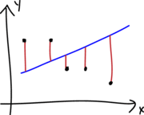
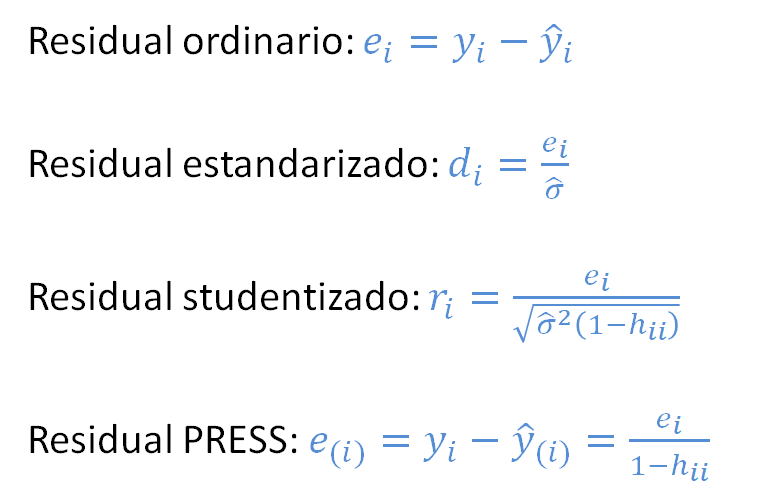
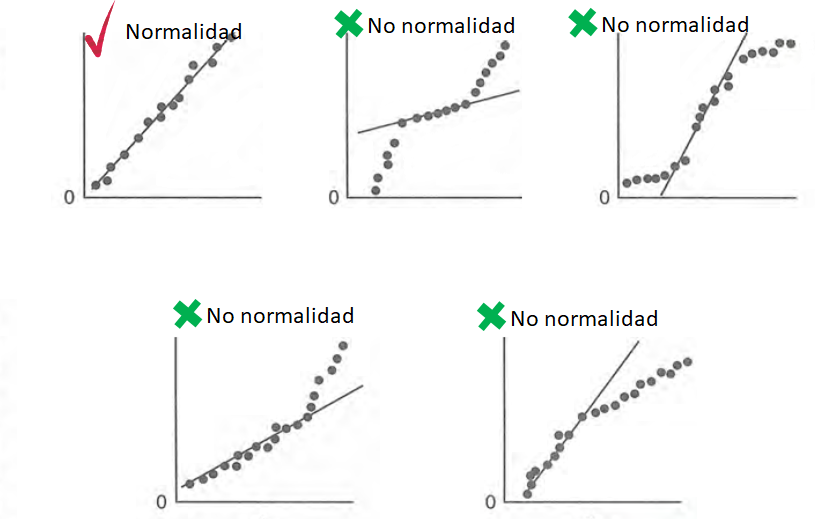
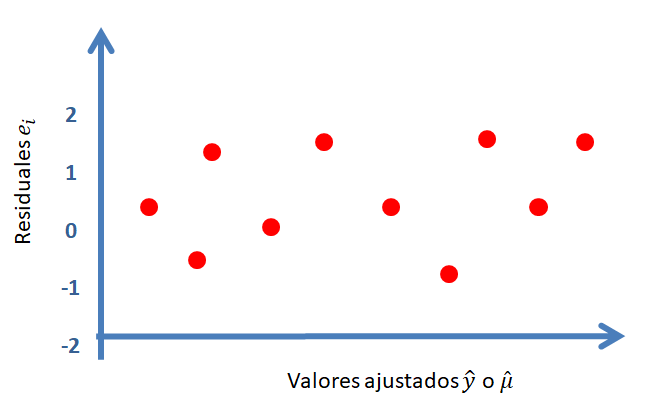
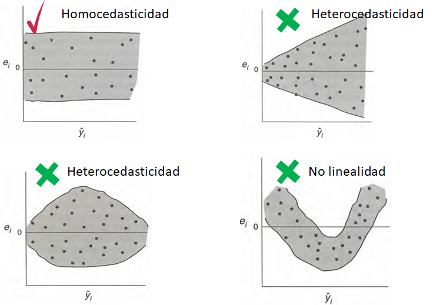
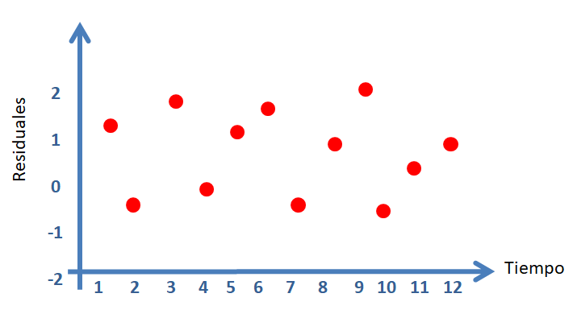
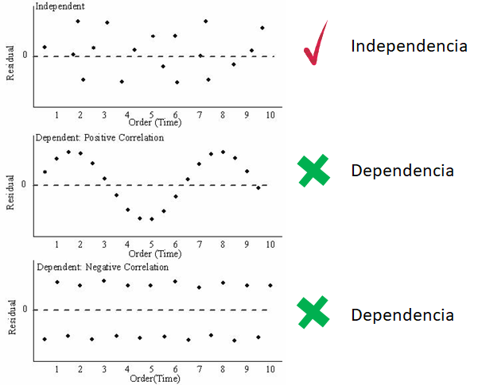

# Diagnósticos parte I {#diag1}
En este capítulo se presentan varias herramientas útiles para hacer diagnósticos de un modelo ajustado.

## Residuales {-}
Los residuales en los modelos de regresión nos ayuda a:

- determinar qué tan bien el modelo explica el patrón de los datos,
- verificar el cumplimiento de los supuestos del modelo.

<p align="center">
  
</p>

A continuación se muestran los diferentes tipos de residuales que se pueden definir para un modelo de regresión.

<p align="center">
  
</p>

La cantidad $w_i$ corresponde al peso o importancia de cada observación en el modelo, por defecto es $w_i=1$. 

La cantidad $h_{ii}$ se llama leverage y corresponde al elemento $i$ de la diagonal de la matriz sombrero o hat $\boldsymbol{H} = \boldsymbol{X}(\boldsymbol{X}^\top \boldsymbol{X})^{-1}\boldsymbol{X}^\top$. 

La varianza $\hat{\sigma}_{(i)}^{2}$ es la varianza estimada al __NO__ tener en cuenta la observación $i$-ésima. La cantidad $\hat{y}_{(i)}$ es la estimación de la $i$-ésima observación usando un modelo en el cual la observación $i$-ésima __NO__ fue usada en el ajuste del modelo.

Para obtener los residuales arriba definidos tenemos las siguientes funciones:

```{r eval=FALSE}
residuals(object, type=c("working", "response", "deviance", "pearson", "partial"))
rstandard(object)
rstudent(object)
```

Si un modelo lineal está correctamente especificado (ajustado), los residuos de Pearson serán independientes de los valores ajustados e independientes de los predictores, y estos gráficos deben ser "gráficos nulos", es decir, gráficos sin características sistemáticas, en el sentido de que la distribución condicional de los residuos (en el eje vertical del gráfico) no debe cambiar con los valores ajustados o con un predictor (en el eje horizontal) [@fox2019].

### Ejemplo {-}
Considere los datos mostrados abajo, ajuste un modelo de regresión lineal para explicar la media de $y$ en función de $x$ y usando como pesos los valores de $w$. Obtenga los residuales usando las definiciones y luego usando las funciones de R, compruebe que los resultados coinciden.

```{r}
x <- c(4, 6, 8, 7, 8, 5)
y <- c(1, 2, 3, 4, 5, 4)
w <- c(0.1, 0.1, 0.2, 0.1, 0.2, 0.9)
```

__Solución__

Primero se van a calcular los residuales manualmente aplicando las definiciones.

```{r}
mod <- lm(y ~ x, weights=w)

ei <- y - fitted(mod)
pi <- ei * sqrt(mod$weights)
hii <- lm.influence(mod)$hat
di <- ei * sqrt(mod$weights) / sqrt(summary(mod)$sigma^2 * (1-hii))
ri <- ei * sqrt(mod$weights) / sqrt(lm.influence(mod)$sigma^2 * (1-hii))

cbind(ei=ei, pi=pi, di=di, ri=ri)
```

Ahora se van a calcular los residuales usando las funciones de R.

```{r}
cbind(ei=residuals(mod, type='working'),
      pi=residuals(mod, type='pearson'),
      di=rstandard(mod),
      ri=rstudent(mod))
```

Estimado lector, __¿qué puede usted concluir de los resultados de este ejemplo?__

## Supuestos {-}
Los supuestos en un modelo de regresión se pueden escribir de dos formas:

__Forma I__

1. Los errores $e_i$ tienen distribución normal.
2. Los errores $e_i$ tienen media cero.
3. Los errores $e_i$ tiene varianza constante.
4. Los errores $e_i$ no están correlacionados.

__Forma II__

1. La respuesta $y$ tiene distribución normal.
2. La varianza de la respuesta $y$ es constante.
3. Las observaciones son independientes $y$.
4. Relación lineal entre la variable respuesta y las covariables.

Ambos conjuntos de supuestos son equivalentes, la forma I está dirigida hacia los $e_i$ mientras que en la forma II está dirigida hacia los $y_i$.

## Chequeando normalidad de los errores $e_i$ {-}
Para estudiar si lo errores $e_i$ tienen una distribución aproximadamente normal se construyen los residuales estandarizados $d_i$. Una vez calculados los $d_i$ se construye un gráfico de normalidad o qqplot usando la función `qqnorm`, el resultado es un gráfico similar al mostrado a continuación.

<p align="center">
  
</p>

En la siguiente figura se muestran los diferentes patrones que se pueden encontrar en el gráfico de normalidad para $d_i$. Para que se cumpla el supuesto de normalidad de los errores $e_i$ se necesita que los $d_i$ estén lo más alineados con la recta de referencia, alejamientos severos de esta recta significa que se viola el supuesto de normalidad de $e_i$.

<p align="center">
  
</p>

## Chequeando si errores $e_i$ con media cero {-}
Para determinar si los errores $e_i$ tienen una media cerca al valor de cero se puede usar la función `mean` sobre los residuales.

## Chequeando si los errores $e_i$ tiene varianza constante {-}
En la siguiente figura se muestra el caso de varianza $\sigma^2$ constante (homocedasticidad) y el caso de varianza $\sigma^2$ no constante (heterocedasticidad). La homocedasticidad es el supuesto exigido en modelos de regresión.

<p align="center">
  
</p>

Para chequear si los errores $e_i$ tiene varianza constante se construye un gráfico de $e_i$ versus $\hat{\mu}_i$, un gráfico similar al mostrado a continuación.

<p align="center">
  
</p>

En la siguiente figura se muestran los diferentes patrones que se pueden encontrar en el gráfico de $e_i$ versus $\hat{\mu}_i$. Para que se cumpla el supuesto de homocedasticidad se necesita que los puntos se ubiquen como una nube de puntos sin ningún patrón claro. Cualquier patrón que se observe es evidencia de que no se cumple el supuesto de homocedasticidad.

<p align="center">
  
</p>

Una analogía útil para recordar si se cumple la homocedasticidad es que el gráfico de $e_i$ versus $\hat{\mu}_i$ tenga una apariencia como la mostrada en la siguiente figura.

<p align="center">
  
</p>

Otro gráfico útil para chequear el supuesto de homocedasticidad es dibujar un diagrama de dispersión de $\sqrt{|d_i|}$ versus $\hat{\mu}_i$, un gráfico similar al mostrado a continuación.

<p align="center">
  
</p>

Al igual que en el gráfico de $e_i$ versus $\hat{\mu}_i$, se espera que no existan patrones claros en la nube de puntos.

## Prueba de hipótesi para chequear si los errores $e_i$ tiene varianza constante {-}
El paquete **lmtest** creado por @R-lmtest tiene varias funciones que nos permiten chequear la homocedasticidad de los errores. En las prueba mostradas a continuación la hipótesis nula $H_0:$ es que hay homocedasticidad frente a la hipótesis alterna $H_1:$ de que hay heterocedasticidad.

Las funciones disponibles se listan a continuación.

- `bptest`: Breusch-Pagan Test.
- `gqtest`: Goldfeld-Quandt Test.
- `hmctest`: Harrison-McCabe test.

Se le recomienda al lector que consulte la ayuda de cada una de las funciones para que tenga más información de las pruebas mencionadas. A continuación un ejemplo de cómo usar las pruebas anteriores.

### Ejemplo {-}
Simule un conjunto de datos donde se viole la hipótesis de varianza constante (de los $e_i$ o de las $y_i$) y aplique las pruebas de hipótesis para ver si son capaces de detectar la violación del supuesto de homocedasticidad.

__Solución__


## Chequeando si errores $e_i$ no están correlacionados {-}
Para estudiar esta situación se debe tener la historia de los errores, es decir, el orden en que las observaciones fueron tomadas. Usando es información se puede dibujar un diagrama de dispersión del residual versus tiempo,  un gráfico similar al mostrado a continuación.

<p align="center">
  
</p>

En la siguiente figura se muestran los diferentes patrones que se pueden encontrar en el gráfico de $e_i$ versus el tiempo. Para que se cumpla el supuesto de independencia se espera que los puntos se ubiquen como una nube de puntos sin ningún patrón claro.

<p align="center">
  
</p>

### Ejemplo {-}
En este ejemplo vamos a simular 500 observaciones del modelo mostrado abajo, luego vamos a ajustar un modelo correcto a los datos y por último vamos a realizar el análisis de residuales para saber si el modelo fue bien ajustado.

\begin{align*} 
y_i &\sim  N(\mu_i, \sigma^2) \\ 
\mu_i &= 4 - 6 x_i \\
x_i &\sim U(-5, 6) \\
\sigma^2 &= 16
\end{align*}

__Solución__

Lo primero que se debe hacer es simular los datos y ajustar el modelo.

```{r}
gen_dat <- function(n) {
  varianza <- 16
  x <- runif(n=n, min=-5, max=6)
  media <- 4 - 6 * x
  y <- rnorm(n=n, mean=media, sd=sqrt(varianza))
  marco_datos <- data.frame(y=y, x=x)
  return(marco_datos)
}

datos <- gen_dat(n=500)
mod <- lm(y ~ x, data=datos)
```

Los gráficos de residuales explicados anteriormente se pueden obtener usando la función `plot` sobre el modelo ajustado `mod`.

```{r resid01, fig.height=6, fig.width=6, fig.align='center'}
par(mfrow=c(2, 2))
plot(mod, las=1, col='deepskyblue4', which=1:3)
```

En la figura anterior se observa que los puntos del gráfico de normalidad de los residuales estandarizados $d_i$ están muy cerca de la línea de referencia. Los diagramas de dispersión entre los residuales versus $\hat{\mu}_i$ no muestran ninguna anomalía. Por estas razones podemos asumir que los supuestos del modelo se cumplen.

```{block2, type='rmdnote'}
En este ejemplo se usó `plot(mod, which=1:3)` para obtener los tres primeros gráficos que entrega la función `plot`, el cuarto gráfico no es un gráfico de residuales y por eso se evitó en el ejemplo.
```

### Reto para el lector {-}
Use la información del ejemplo anterior y viole alguno de los supuestos dentro de la función `gen_dat` o al momento de ajustar el modelo con `lm`. Luego construya los gráficos de residuales y compruebe que los gráficos le indicarán que algo no está bien en el modelo ajustado.

## Gráficos de residuales usando car {-}
El paquete **car** de @R-car, tiene unas funciones especiales para crear otro tipo de gráficos de residuales y que son útiles para identificar posibles anomalías en el modelo ajustado. A continuación las funciones para crear nuevos gráficos de residuales.

- `residualPlots(model)`: dibuja una gráfica de los residuos de Pearson versus cada término del predictor lineal y los valores ajustados $\hat{\mu}_i$. También entrega los resultados de una prueba de hipótesis para saber si se debe agregar un término cuadrático de cada variable. 
- `mmps` o `marginalModelPlots(model)`: dibuja una gráfica de la respuesta $y_i$ versus cada covariable cuantitativa y los valores ajustados $\hat{\mu}_i$, es una variación la propuesta de @cook_weisber97.


### Ejemplo {-}
Este ejemplo corresponde al ejemplo mostrado en el capítulo 6 de @fox2019.

En este ejemplo se desea ajustar un modelo de regresión para explicar la media de la variable prestige en función de las variables education, income y type, usando la base de datos `Prestige` del paquete **car** [@R-car].

<p align="center">
  
</p>

```{r message=FALSE}
library(car)
prestige_mod1 <- lm(prestige ~ education + income + type, data=Prestige)
```

Para construir los gráficos de los residuos de Pearson versus cada término del predictor lineal y los valores ajustados $\hat{\mu}_i$ se usa la siguiente instrucción (`las=1` para poner los números vertical en el eje Y).

```{r resid_car01, fig.height=6, fig.width=6, fig.align='center'}
residualPlots(prestige_mod1, las=1)
```

De la figura anterior se observa lo siguiente:

- El gráfico de residuales vs education se asemeja a un "gráfico nulo", en la que ningún patrón particular es aparente.
- El gráfico de residuales vs income presenta una curvatura.
- El gráfico de residuales vs type (var. cuali.) presenta una apariencia de un "gráfico nulo", todas las cajas con a proximadamente el mismo centro y extensión.
- De los tres comentarios anteriores parece que falta el término $Income^2$ en el predictor lineal.

La sospecha de que falta el término $Income^2$ se ve reforzada por la tabla que acompaña la salida de `residualPlots(prestige_mod)`. En la línea para la variable `income` se tiene la prueba de hipótesis:

- $H_0:$ no se necesita $Income^2$,
- $H_A:$ si se necesita $Income^2$. 

El valor-P de esta prueba es 0.004854 y por lo tanto se justifica incluir $Income^2$.

Para dibujar los gráficos marginales de $y_i$ versus cada covariable cuantitativa y los valores ajustados $\hat{\mu}_i$ se usa la siguiente instrucción.

```{r resid_car02, fig.height=6, fig.width=6, fig.align='center'}
marginalModelPlots(prestige_mod1, las=1)
```

La línea de color azul es una regresión lowess entre $y_i$ y la variable que está en el eje horizontal. La línea de color rojo es una regresión lowess entre $\hat{\mu}_i$ y la variable que está en el eje horizontal. Según @fox2019, si el modelo se ajusta bien a los datos, las líneas (azul y roja) estarán próximas, por el contrario, si las líneas difieren demasiado, es evidencia de que el modelo no explica bien los datos.

De la figura anterior se observa que las líneas (azul y roja) difieren un poco en el panel de $y_i$ versus income, eso refuerza lo observado antes de que sería bueno agregar un término `I(income^2)`.

```{r}
prestige_mod2 <- lm (prestige ~ education + income + I(income^2) + type, data=Prestige)
```

```{r resid_car03, fig.height=8, fig.width=6, fig.align='center'}
residualPlots(prestige_mod2, las=1)
```

```{r}
anova(prestige_mod1, prestige_mod2)
```

