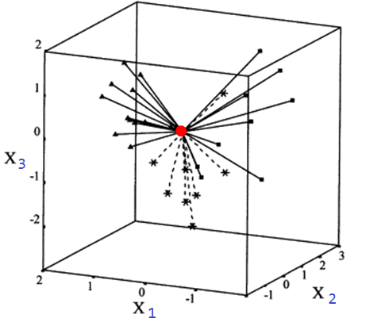
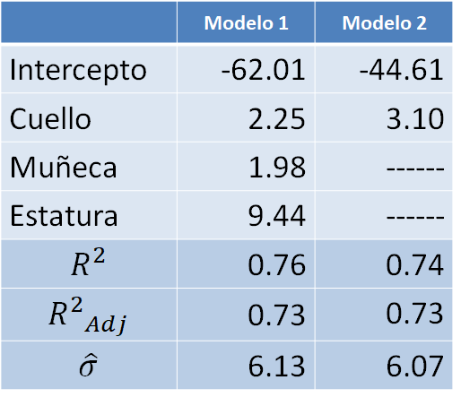

# Diagnósticos parte II {#diag2}
En este capítulo se presentan otras herramientas útiles para realizar diagnósticos.

## Matriz sombrero o hat {-}
La matriz sombrero o matriz Hat se define así:

$$
\boldsymbol{H} = \boldsymbol{X}(\boldsymbol{X}^\top \boldsymbol{X})^{-1}\boldsymbol{X}^\top
$$

Esta matriz contiene en su diagonal las distancias relativas desde el centroide de los datos hasta cada uno de los puntos. En la siguiente figura se ilustra el concepto de distancia relativa entre el centroide (color rojo) de las variables explicativas y cada uno de los puntos para un caso con tres variables explicativas $x_1$, $x_2$ y $x_3$.

<p align="center">
  
</p>

La cantidad $h_{ii}$ se llama leverage y corresponde al elemento $i$ de la diagonal de la matriz sombrero $\boldsymbol{H}$. Los valores de $h_{ii}$ cumplen lo siguiente:

- siempre están entre $1/n$ y 1. 
- la suma $\sum h_{ii}$ es igual al número de $\beta$'s del modelo (incluyendo $\beta_0$).

Si la observación $i$-ésima tiene un valor grande de $h_{ii}$ significa que ella tiene valores inusuales de $\boldsymbol{x}_i$, mientras que valores pequeños de $h_{ii}$ significa que la observación se encuentra cerca del centroide de los datos.

```{block2, type='rmdwarning'}
La distancia $h_{ii}$ no incluye información de la variable respuesta $y$, solo de las covariables, esto se nota claramente en la fórmula de $\boldsymbol{H}$ dada arriba.
```

¿Para qué se usan los $h_{ii}$ en la práctica?

En el siguiente apartado se explicará el uso de los $h_{ii}$.

## ¿Qué es extrapolación oculta? {-}
Suponga tenemos un modelo de regresión una variable respuesta y dos covariables $x_1$ y $x_2$. En la siguiente figura se ilustra los posibles datos desde una vista superior (sin ver los valores de $y$). Esa elipse o forma se llama Regressor Variable Hull (RVH) o cascarón de los datos.

<p align="center">
  
</p>

Una vez se tenga el modelo ajustado podríamos usar valores de $x_1$ y $x_2$ para estimar la media de $y$. Lo ideal es usar el modelo para predecir la media de $y$ con valores de $x_1$ y $x_2$ que se encuentren dentro del cascarón. 

Si tratamos de estimar la media de $y$ para valores de las covariables fuera del cascarón, como en el caso del punto rojo, no podemos garantizar que el modelo tenga un buen desempeño debido a que el modelo no se entrenó con ese tipo de ejemplos.

El problema de __extrapolación oculta__ se presenta cuando tratamos de predecir información de $y$ con covariables fuera del cascarón. La extrapolación oculta es fácil de identificarla cuando sólo se tiene dos covariables, pero, ¿cómo saber si se está haciendo extrapolación oculta cuando se tienen varias covariables. 
Supongamos que queremos saber si el vector de covariables $\boldsymbol{x}_0=(x_1, x_2, \ldots, x_p)^\top$ está o no dentro del cascarón, dicho de otra manera, ¿se cometería extrapolación oculta usando $\boldsymbol{x}_0$?. Los pasos para determinar si $\boldsymbol{x}_0$ está o no dentro del cascarón son:

1. Calcular la matriz $\boldsymbol{H}$.
2. Obtener los valores $h_{ii}$ de la matriz $\boldsymbol{H}$.
3. Identificar $h_{max} = max\{h_{11}, h_{22}, \ldots, h_{nn}\}$.
4. Calcular $h_{00} = \boldsymbol{x}_0 (\boldsymbol{X}^\top \boldsymbol{X})^{-1} \boldsymbol{x}_0^\top$.
5. Si $h_{00} > h_{max}$ el punto $\boldsymbol{x}_0$ está fuera del cascarón y se podría estár cometiendo extrapolación oculta.

Los valores $h_{ii}$ se pueden obtener al calcular la matriz $\boldsymbol{H}$. Otra forma de obtener los $h_{ii}$ es ajustando el modelo de regresión y luego usando la función `hatvalues(model)` o `lm.influence(model)`.

### Ejemplo {-}
Calcular los valores $h_{ii}$ para un modelo de regresión `y ~ x + z` con los siguientes datos.

```{r}
y <- c(2, 3, 6, 5)
x <- c(3, 5, 6, 7)
z <- c(5, 4, 6, 3)
```

__Solución__

A seguir se muestran las tres formas para obtener los valores $h_{ii}$.

```{r}
# Forma 1
X <- cbind(1, x, z)
H <- X %*% solve(t(X) %*% X) %*% t(X)
H
diag(H)

# Forma 2
mod <- lm(y ~ x + z)
hatvalues(mod)

# Forma 3
lm.influence(mod)$hat
```

### Reto para el lector {-}
Use la información del ejemplo anterior y determine si la observación con valores de $x=4$ y $z=1$ está o no dentro del cascarón de los datos, en otras palabras, determine si se podría cometer extrapolación oculta al usar el modelo ajustado con $x=4$ y $z=1$.

## Punto atípico (outlier) y punto influyente {-}
Los conceptos de atípico e influyente son diferentes y se definen así:

- Punto atípico (outlier): es una observación que es numéricamente distante del resto de los datos.
- Punto influyente: punto que tiene impacto en las estimativas del modelo.

En la siguiente figura se ilustra la diferencia entre los conceptos de atípico e influyente.

<p align="center">
  
</p>

¿Cómo se puede saber si un punto es influyente?

Para saber si un punto es influyente debemos tener una métrica o medida para determinar si él es influyente, una medida podría ser la Distancia de Cook.

## Prueba de Bonferroni para detectar outliers
El paquete **car** [@R-car] tiene la función `outlierTest` para realizar una prueba de hipótesis con $H_0:$ la observación $i$-ésima NO es un outlier frente a $H_1:$ la observación $i$-ésima SI es un outlier. La estructura de la función `outlierTest` se muestra a continuación.

```{r eval=FALSE}
outlierTest(model, cutoff=0.05, n.max=10, order=TRUE, labels=names(rstudent), ...)
```

En la sección 11.3.1 del libro @fox2015applied están los detalles de la prueba, se invita al lector para que los consulte.

### Ejemplo {-}
En este ejemplo se usará una base de datos que contiene medidas corporales para un grupo de estudiantes universitarios que vieron el curso de modelos de regresión en el año 2013. Abajo se muestra una figura ilustrativa de los datos.

<p align="center">
  
</p>

El objetivo es determinar si hay alguna observación que se pueda considerar como outlier cuando se ajusta un modelo de regresión para explicar el peso corporal en función de las otras covariables.

__Solución__

Primero vamos a ajustar el modelo y luego vamos a aplicar la prueba de Bonferroni para detectar outliers.

```{r}
url <- "https://raw.githubusercontent.com/fhernanb/datos/master/medidas_cuerpo2"
datos <- read.table(file=url, sep="\t", header=TRUE)

mod <- lm(Peso ~ Estatura + circun_cuello + circun_muneca, data=datos)

library(car)
outlierTest(mod, cutoff=Inf, n.max=4)
```

En la salida de arriba vemos las cuatro observaciones (`n.max=4`) que tienen los mayores valores de residual estudentizado $r_i$. La observación ubicada en la línea 11 es la única con un valor-P muy pequeño y por lo tanto hay evidencias para considerar esa observación como un posible outlier.

Es posible dibujar los resultados de la prueba para cada observación usando la función `influenceIndexPlot` del paquete **car**. En la siguiente figura se observa que sólo la observacion 11 es identificada como un posible outlier.

```{r bonf_test_01, fig.height=6, fig.width=6, fig.align='center'}
influenceIndexPlot(mod, vars="Bonf", las=1)
```

## Distancia de Cook {-}
Es una medida de cómo influye la observación $i$-ésima sobre la estimación de $\boldsymbol{\beta}$ al ser retirada del conjunto de datos. Una distancia de Cook grande significa que una observación tiene un peso grande en la estimación de $\boldsymbol{\beta}$.

$$
D_i = \frac{\sum_{j=1}^{n} (\hat{y}_j - \hat{y}_{j(i)} )^2 }{p \hat{\sigma^2}},
$$

donde la notación $(i)$ significa "sin la observación $i$-ésima", eso quiere decir que $\hat{y}_{j(i)}$ es la estimación de $j$-ésima sin haber tenido en cuenta $i$-ésima observación en el ajuste del modelo. La cantidad $p$ se refiere a todos los $\beta$'s en el modelo ($\beta_0, \beta_1, \beta_2, \ldots, \beta_k$).

<p align="center">
  
</p>

```{block2, type='rmdnote'}
Son puntos influyentes las observaciones que presenten $D_i=\frac{4}{n-p-2}$.
```

### Ejemplo: ¿cómo se relaciona el peso corporal con la circunferencia de la muñeca, cuello y estatura? {-}
En este ejemplo se usará una base de datos que contiene medidas corporales para un grupo de estudiantes universitarios que vieron el curso de modelos de regresión en el año 2013. Abajo se muestra una figura ilustrativa de los datos.

<p align="center">
  
</p>

El objetivo es ajustar un modelo de regresión para explicar el peso promedio en función de la circunferencia de la muñeca, cuello y estatura. Luego de ajustar el modelo se deben identificar los posible estudiantes influyentes y el efecto de ellos en el modelos.

__Solución__

Lo primero es cargar los datos en nuestra sesión de R.

```{r}
url <- "https://raw.githubusercontent.com/fhernanb/datos/master/medidas_cuerpo2"
datos <- read.table(file=url, sep="\t", header=TRUE)
head(datos, n=5)
```

Antes de ajustar cualquier modelo es fundamental hacer un análisis descriptivo de los datos. Comenzaremos construyendo un diagrama de dispersión con `pairs`.

```{r upb_01, fig.height=6, fig.width=6, fig.align='center'}
panel.cor <- function(x, y, digits=2, prefix="", cex.cor, ...) {
  usr <- par("usr"); on.exit(par(usr))
  par(usr=c(0, 1, 0, 1))
  r <- cor(x, y)
  txt <- format(c(r, 0.123456789), digits=digits)[1]
  txt <- paste(prefix, txt, sep="")
  if(missing(cex.cor)) cex.cor <- 0.8/strwidth(txt)
  text(0.5, 0.5, txt, cex=cex.cor * r, col=gray(1-r))
}

# Creamos el grafico SOLO para las variables cuantitativas
pairs(datos[, c("Peso", "Estatura", "circun_cuello", "circun_muneca")], 
      pch=19, las=1,
      upper.panel=panel.smooth, lower.panel=panel.cor)
```

De la figura anterior se observa que hay un punto que se aleja de la nube, es un estudiante que pesa un poco más de 100 kilogramos.

En la siguiente figura se muestran los valores de $h_{ii}$ para cada estudiante, esta figura se obtiene con la función `influenceIndexPlot` del paquete **car**.

```{r hii_estudiantes_upb, fig.height=6, fig.width=6, fig.align='center'}
influenceIndexPlot(mod, vars="hat")
```

De la figura anterior se observa que los estudiantes 3 y 17 fueron señalados por estár muy lejos del centroide de los datos. 

Vamos ahora a ajustar nuestro primer modelo.

```{r}
mod1 <- lm(Peso ~ Estatura + circun_cuello + circun_muneca, data=datos)
summary(mod1)
```

Como en la tabla anterior aparecen variables que nos son significativas vamos a realizar una selección de variables usando el paquete **mixlm** creado por @R-mixlm. Vamos a realizar una selección de variables de manera que sólo queden variables significativas con un $\alpha=0.04$.

```{r}
mod2 <- mixlm::backward(mod1, alpha=0.04)
summary(mod2)
```

En la siguiente tabla se comparan los modelos 1 y 2 ajustados hasta ahora.

<p align="center">
  
</p>

De la tabla anterior podemos destacar lo siguiente:

- El intercepto estimado cambia bastante.
- En el modelo 2 la variable cuello aumenta su efecto.
- El $R^2$ se mantiene constante.
- La varianza de los errores disminuye, eso significa que el modelo 2 deja menos sin explicar.

Vamos ahora a crear el diagrama de dispersión con el modelo ajustado.

```{r upb_02, fig.height=4, fig.width=5, fig.align='center'}
# Para construir el grafico de dispersion
with(datos, 
     plot(x=circun_cuello, y=Peso, pch=19, las=1,
          xlab="Circunferencia cuello (cm)", ylab="Peso (Kg)"))
# Ahora agregamos la linea de tendencia
abline(mod2, lwd=3, col='blue2')
# por ultimo un texto con la ecuacion o modelo ajustado
text(x=34, y=95, expression(hat(Peso) == -44.61 + 3.10 * C.cuello), 
     col='blue3' )
```

De la figura anterior vemos que hay un estudiante (el de 100 kilos de peso) que está muy alejado de la recta de regresión. 

Vamos a calcular las distancia de Cook para las observaciones del modelo 2 así:

```{r}
cooks.distance(mod2)
```

Es mejor representar las distancias de Cook en forma gráfica para identificar los posible puntos influyentes así:

```{r upb_03, fig.height=4, fig.width=5, fig.align='center'}
cutoff <- 4 / (26-2-2)
plot(mod2, which=4, cook.levels=cutoff, las=1)
abline(h=cutoff, lty="dashed", col="springgreen3")
```

De esta figura es claro que las observaciones 11 y 8 tienen $D_i$ por encima de la cota y se consideran observaciones influyentes.

Ahora vamos a revisar los residuales del modelo 2.

```{r upb_04, fig.height=6, fig.width=6, fig.align='center'}
par(mfrow=c(2, 2))
plot(mod2, col='deepskyblue4')
```

De la anterior figura vemos que las observaciones 8, 11 y 13 fueron identificadas por tener valores de residuales grandes.

Vamos ahora a identificar las observaciones 8, 11, 12 y 13 en un diagrama de dispersión.

```{r upb_05, fig.height=4, fig.width=5, fig.align='center', echo=FALSE}
with(datos, 
     plot(x=circun_cuello, y=Peso, pch=19, las=1, xlim=c(29, 43), ylim=c(45, 110),
          xlab="Circunferencia cuello (cm)", ylab="Peso (Kg)"))
abline(mod2, lwd=3, col='blue2')
text(x=34, y=95, expression(hat(Peso) == -44.61 + 3.10 * C.cuello), 
     col='blue3')
points(x=datos$circun_cuello[c(8, 11, 12, 13)],
       y=datos$Peso[c(8, 11, 12, 13)], pch=21, col='red', cex=2)
text(x=datos$circun_cuello[c(8, 11, 12, 13)] + 0.8,
       y=datos$Peso[c(8, 11, 12, 13)], c(8, 11, 12, 13), col='red')
```

La observación 11 es un hombre que pesa más de 100 kilos y que solo mide 1.79 metros. Las observaciones 8, 12 y 13 son mujeres con las mayores diferencias entre $y_i$ y $\hat{y}_i$, para ellas el modelo sobreestima el peso corporal.

En la siguiente tabla se muestran los resultados de ajustar nuevamente el modelo 2 bajo tres situaciones: con todas las observaciones, sin la observación 11 y sin las observaciones 8, 11, 12 y 13. De la tabla vemos que la observación 11 es muy influyente, al sacar esa observación el modelo aumenta su $R^2$ y disminuye su $\sigma^2$. De la última columna se observa el mismo comportamiento, $R^2$ aumenta y disminuye su $\sigma^2$ al sacar todas las observaciones sospechosas. 

<p align="center">
  
</p>

Pero, ¿cuál modelo debo usar como modelo final? ¿El modelo 2, el modelo 2 sin la obs 11 o el modelo 2 sin las obs 8, 11, 12 y 13?

Lo que se recomienda es que el analista se asesore de un experto en el área de aplicación para que juntos estudien esas observaciones sospechosas. Si hay una razón de peso para considerarlas como observaciones atípicas, ellas deben salir del modelo. Si por el contrario, no hay nada raro con las observaciones ellas deben seguir en el modelo. 

<p align="center">
  
</p>

```{block2, type='rmdwarning'}
Las observaciones sospechosas NO se deben sacar inmediatamente del modelo. Antes se deben estudiar para ver si hay algo raro con ellas, en caso afirmativo se sacan de la base y se ajusta nuevamente el modelo.
```

```{block2, type='rmdnote'}
Una observación influyente NO es una observación mala en el modelo. Al contrario, ella es una observación clave en el ajuste porque "lidera" la estimación.

Una observación que no es influyente es una observación que estando presente o no, el modelo ajustado no se ve afectado.
```

## DFFITS {-}
Se puede investigar la influencia de eliminar la $i$-ésima observación sobre el valor predicho o ajustado.

$$
DFFITS_i = \frac{\hat{y}_i - \hat{y}_{i(i)}}{\sqrt{s_{(i)}^2 h_{ii}}}.
$$

Se sugiere que merece investigarse toda observación con $|DFFITS| > 2 \sqrt{p/n}$.

La función en R para obtener los $DFFITS_i$ es `dffits`.

## DFBETAS {-}
Indica cuánto cambia el coeficiente de regresión, en unidades de desviación estándar, si se omitiera la 𝑖-ésima observación.

$$
DFBETAS_{i,j} = \frac{\hat{\beta}_j - \hat{\beta}_{j(i)}}{\sqrt{s_{(i)}^2 C_{jj}}},
$$

donde $C_{jj}$ es $j$-ésimo elemento de la diagonal de $(\boldsymbol{X}^\top \boldsymbol{X})^{-1}$. Se sugiere que merece investigarse toda observación con $|DFBETAS| > 2 \sqrt{n}$.

La función en R para obtener los $DFBETAS_{i,j}$ es `dfbetas`.

### Ejemplo {-}
En R se pueden encontrar las funciones `dfbeta` y `dfbetas`, esto puede generar alguna confusión y por esa razón vamos a explicar con detalle el asunto.

__Solución__

Vamos a crear unos datos para el ejemplo.

```{r}
# Creando unos datos de ejemplo
datos <- data.frame(x=1:5, y=rnorm(5))
mod <- lm(y ~ x, data=datos)
```

```{r}
dfbeta(mod)
```

```{r}
dfbetas(mod)
```

```{r}
# DFBETAS para la pendiente manual para i=1
mod1 <- lm(y ~ x, data=datos[-1, ])

# Para obtener dfbeta de pendiente para i=1
coef(mod)[2] - coef(mod1)[2]
```

```{r}
# Para obtener dfbetas de pendiente para i=1
numerator <- mod$coef[2] - mod1$coef[2]
denominator <- sqrt(summary(mod1)$sigma^2 * 
	         diag(summary(mod)$cov.unscaled)[2])
DFBETAS <- numerator/denominator
DFBETAS
```

En conclusión,

1. La función `dfbeta` entrega $\hat{\beta}_j - \hat{\beta}_{j(i)}$.
2. La función `dfbetas` entrega $\frac{\hat{\beta}_j - \hat{\beta}_{j(i)}}{\sqrt{s_{(i)}^2 C_{jj}}}$.

¿Cuál de las dos funciones se debe usar?

