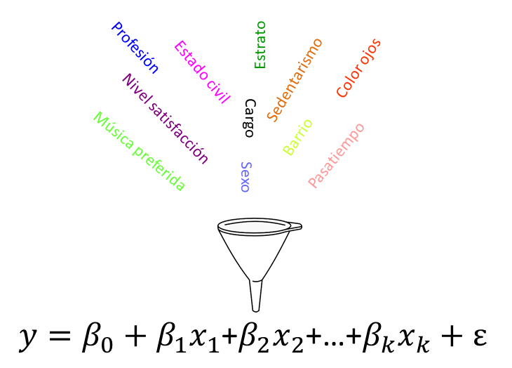
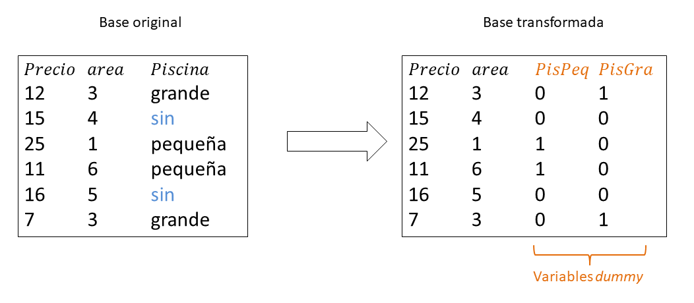
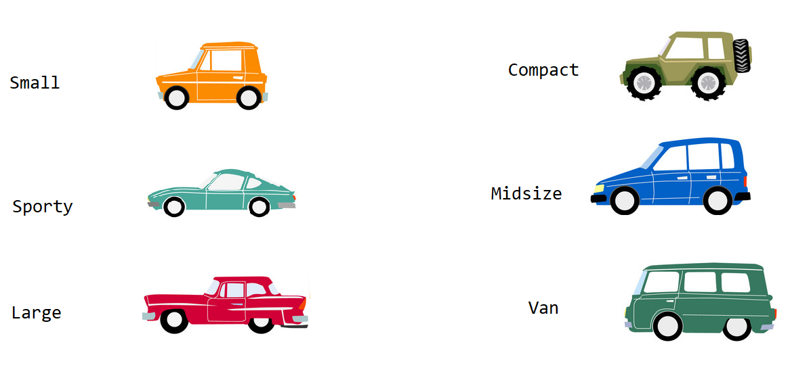

# Modelos con variables cualitativas {#varcuali}
En este capítulo se muestra cómo incluir variables cualitativas en un modelo de regresión con R.

## ¿Es posible incluir variables cualitativas? {-}
Una de las preguntas frecuentes entre los que inician el estudio de los modelos de regresión es: ¿se pueden incluir variables cualitativas en un modelo de regresión?

La respuesta es __SI__, definitivamente si.

A continuación una figura que ilustra algunas de las variables que se pueden incluir en la construcción de un modelo de regresión.

```{r echo=F, fig.cap='Variables variables cualitativas a incluir en un modelo.', dpi=80, fig.align='center'}

```

## Variable indicadora, dummy, ficticia o binaria  {-}
La palabra indicadora, dummy, ficticia o binaria es la denominación genérica para una variable que toma valores de 0 o de 1 y que se utiliza para re-expresar variables cualitativas.

Observe la figura \@ref(fig:cuali02). En la parte izquierda se tiene una base original de ejemplo con las variables precio, área y piscina, asociadas a seis apartamentos. La variable cualitativa Piscina de niveles __sin__, __pequeña__ y __grande__, el nivel __sin__ es el nivel de referencia natural. 

Al lado derecho de la figura \@ref(fig:cuali02) está la base transformada y vemos que hay 4 variables. Las nuevas variables __PisPeq__ y __PisGra__ son 2 variables indicadoras que logran resumir la información de la variable Piscina que tiene 3 variables.

Para comprender como las 2 variables indicadoras pueden resumir la información de la variable Piscina, vamos a considerar los siguientes tres casos:

1. Si `PisPeq = 0` y `PisGra = 0`, entonces el apartamento  está __SIN__ piscina.
1. Si `PisPeq = 1` y `PisGra = 0`, entonces el apartamento tiene piscina __PEQUEÑA__.
1. Si `PisPeq = 0` y `PisGra = 1`, entonces el apartamento tiene piscina __GRANDE__.

```{r cuali02, echo=F, fig.cap='Transformando una base de datos con variables cualitativas.', dpi=80, fig.align='center'}

```

```{block2, type='rmdnote'}
Como regla general, si una variable cualitativa tiene $k$ niveles, se necesitarán de $k-1$ variables indicadoras para resumir la variable cualitativa.
```

## Creando variables indicadoras  {-}
Crear manualmente variables indicadoras para re-expresar variables cualitativas es una tarea muy sencilla, manualmente la podemos hacer. Sin embargo, R posee una herramienta que nos permite convertir la base de datos original en una base de datos transformada (con variables indicadoras). Para este fin se usa la función `model.matrix`.

### Ejemplo {-}
Retomando la base de datos original mostrada en la figura \@ref(fig:cuali02) vamos a crear la matriz de diseño $\boldsymbol{X}$ para ajustar el modelo siguiente:

\begin{align}
Precio_i &\sim N(\mu_i, \sigma^2), \\ 
\mu_i &= \beta_0 + \beta_1 Area_i + \beta_2 PisciPequena_i + \beta_3 PisiGrande_i, \\
\sigma^2 &= \text{constante}
\end{align}

Lo primero a realizar es ingresar los datos para el ejemplo mostrado en la figura \@ref(fig:cuali02). El código necesario se muestra a continuación.

```{r}
Precio <- c(12, 15, 25, 11, 16, 7)
Area <- c(3, 4, 1, 6, 5, 3)
Pisci <- factor(x=c('Grande', 'Sin', 'Pequena', 'Pequena', 'Sin', 'Grande'),
                levels=c('Sin','Pequena','Grande'))
```

Al crear el vector `Pisci` se usó el argumento `levels` dentro de la función `factor` para indicarle a R que el nivel de referencia es `Sin`, seguido de `Pequena` y luego `Grande`.

Para obtener la matriz $\boldsymbol{X}$ con las variables indicadoras (no con la variable original `Pisci`) se hace lo siguiente:

```{r}
model.matrix(Precio ~ Area + Pisci)
```

## Modelos con variables cualitativas  {-}
Para ajustar un modelo de regresión lineal con variables cualitativas se procede de la forma usual como se ajustan modelos con `lm`, no es necesario crear de antemano la matriz $\boldsymbol{X}$, esto porque `lm` internamente crea la matriz de diseño $\boldsymbol{X}$.

### Ejemplo {-}
En este ejemplo vamos a utilizar la base de datos `Cars93` del paquete `MASS`. El objetivo es ajustar el siguiente modelo para explicar el precio del auto en función del tamaño del motor y del tipo de auto, es decir, el objetivo es ajustar el siguiente modelo.

\begin{align}
Precio_i &\sim N(\mu_i, \sigma^2), \\ 
\mu_i &= \beta_0 + \beta_1 EngSize_i + \beta_2 TypeC_i + \beta_3 TypeS_i + \beta_4 TypeM_i + \beta_5 TypeL_i + \beta_6 TypeV_i, \\
\sigma^2 &= \text{constante}
\end{align}

<p align="center">
  
</p>

__Solución__

Lo primero a realizar es cargar el paquete y explorar las variables de interés con la ayuda de la función `str`.

```{r, message=FALSE}
require(MASS)
str(Cars93[, c('Price', 'EngineSize', 'Type')])
```

La variable `Type` tiene 6 niveles, para ver todos niveles usamos el siguiente código.

```{r}
levels(Cars93$Type)
```

De la salida anterior se observan que los niveles son Compact, Large, Midsize, Small, Sporty y Van. Al observar cuidadosamente los niveles vemos que ellos están ordenados por orden lexicográfico, primero Compact por iniciar con la letra __C__, por último Van por iniciar con la letra __V__. Al mirar el modelo requerido se nota que el nivel Small no aparece en la ecuación de $\mu$, esto significa que ese es el nivel de referencia que se encuentra en el intercepto $\beta_0$. Para redefinir los niveles en el orden requerido usamos el siguiente código.

```{r}
Cars93$Type <- relevel(Cars93$Type, ref = 'Small')
levels(Cars93$Type)  # Para verificar el cambio
```

A continuación vamos a crear un diagrama de dispersión para ver la relación entre las variables del problema.

```{r cuanti1, fig.height=3, fig.width=5, fig.align='center', message=FALSE}
library(ggplot2)
ggplot(Cars93, aes(x=EngineSize, y=Price, color=Type)) + 
  geom_point() + theme_light()
```

Ahora si podemos ajustar el modelo solicitado usando el siguiente código.

```{r eval=FALSE}
mod <- lm(Price ~ EngineSize + Type, data=Cars93)
summary(mod)
```

```{r eval=FALSE}
Coefficients:
            Estimate Std. Error t value Pr(>|t|)    
(Intercept)    2.794      2.348   1.190  0.23732    
EngineSize     4.621      1.110   4.164  7.4e-05 ***
TypeCompact    4.644      2.484   1.870  0.06489 .  
TypeLarge      2.053      3.916   0.524  0.60138    
TypeMidsize   10.286      2.700   3.810  0.00026 ***
TypeSporty     5.078      2.634   1.928  0.05721 .  
TypeVan        1.517      3.332   0.455  0.65006    
---
Signif. codes:  0 ‘***’ 0.001 ‘**’ 0.01 ‘*’ 0.05 ‘.’ 0.1 ‘ ’ 1
```

Usando la información de la salida anterior se puede construir el siguiente modelo ajustado.

\begin{align}
\widehat{Precio}_i &\sim N(\hat{\mu}_i, \hat{\sigma}^2), \\ 
\hat{\mu}_i &= 2.794 + 4.621 EngSize_i + 4.644 TypeC_i + 5.078 TypeS_i + 10.286 TypeM_i + \ldots \\
\hat{\sigma} &= 7.068
\end{align}

¿Cómo se interpretan los coeficientes?

- Para cada tipo de auto, si el tamaño del motor se pudiera aumentar en 1 litro, se espera que el precio promedio aumente en 4.621 miles de dólares.
- Si tenemos dos autos, uno small y otro compacto, ambos con el mismo tamaño del motor, se espera que el precio promedio del compacto sea 4.644 miles de dólares mayor con respecto al auto small.
- Si comparamos un auto small y uno midsize, ambos con el mismo tamaño del motor, es de esperarse que el precio promedio del auto midsize sea 10.286 miles de dólares más que el small.
- Dos autos con el mismo tamaño del motos, uno de tipo sporty y otro de tipo large, se espera que el de tipo sporty tenga un precio promedio de 3.025 miles de dólares más que el large (valor obtenido de 5.078-2.053).

```{block2, type='rmdwarning'}
Cuidado, no intente interpretar $\hat{\beta}_0$ en este ejemplo. ¿Por qué?
```

## Significancia de variables cualitativas  {-}
Una pregunta frecuente entre los usuarios es ¿cómo saber si una variable cualitativa es significativa para un modelo?

Cuando se incluye una variable cualitativa de $k$ niveles en un modelo de regresión, aparecen $k-1$ variables indicadoras y por lo tanto $k-1$ valores-P en la tabla resumen. Usar esos valores-P nos puede llevar a conclusiones erróneas.

<p align="center">
  
</p>

Para saber si una variable cualitativa es significativa para un modelo hay dos formas:

1. Crear una anova y ver si la variable cualitativa es significativa en el modelo es decir, usando `anova(mod)`.
2. Crear dos modelos, uno reducido sin la variable cualitativa y otro completo con la variable cualitativa, luego usar un análisis de varianza, `anova(mod.redu, mod)`.

### Ejemplo {-}
En este ejemplo vamos a retomar los datos del ejemplo anterior en el cual se usa la base de datos `Cars93` del paquete `MASS`. El objetivo es ajustar un modelo para explicar el precio del auto en función del tamaño del motor y del tipo de auto. 

Supongamos el tamaño del motor está presente en el modelo, ¿será la variable tipo de auto significativa para el modelo?

<p align="center">
  
</p>

__Solución__

__Forma 1__  
En la forma 1 debemos ajustar el modelo y usar la función `anova` para ver si la variable cualitativa es significativa en el modelo.

Al usar la función `anova` sobre un modelo `mod` obtenido con la función `lm`, aparecerán tantas filas (con valor-P) como número de variables tenga el modelo ajustado. El conjunto de hipótesis para cada una de las filas es:

\begin{align}
H_0 &: \text{la variable de la FILA no aporta información para el modelo}, \\ 
H_A &: \text{la variable de la FILA si aporta información para el modelo}
\end{align}

A continuación el código para usar la forma 1.

```{r}
require(MASS)
data("Cars93")
mod <- lm(Price ~ EngineSize + Type, data=Cars93)
anova(mod)
```

De la salida anterior se observa que el valor-P asociado a Type es de 0.000542, usando un nivel de significancia usual del 5% se concluye que hay evidencias para rechazar $H_0$, es decir, la variable Type si aporta información al modelo.

__Forma 2__  
En la forma 2 debemos crear dos modelos, uno reducido sin la variable cualitativa y otro completo con la variable cualitativa, luego usar un análisis de varianza, `anova(mod_redu, mod_comp)`.

Al usar la función `anova` el conjunto de hipótesis es:

\begin{align}
H_0 &: \text{la variable Type no aporta información para el modelo}, \\ 
H_A &: \text{la variable Type si aporta información para el modelo}
\end{align}

A continuación el código para usar la forma 2. El modelo `mod_redu` contiene un modelo __sin__ la variable cualitativa de interés Type, mientras que el modelo `mod_comp` si la contiene.

```{r}
require(MASS)
data("Cars93")
mod_redu <- lm(Price ~ EngineSize, data=Cars93)
mod_comp <- lm(Price ~ EngineSize + Type, data=Cars93)
anova(mod_redu, mod_comp)
```

De la salida anterior se tiene un valor-P de 0.000542, usando un nivel de significancia usual del 5% se concluye que hay evidencias para rechazar $H_0$, es decir, la variable Type si aporta información para el modelo y por lo tanto es una variable útil.

```{block2, type='rmdnote'}
La decisión final con las formas 1 y 3 siempre coinciden.
```

```{block2, type='rmdwarning'}
Algunas veces una variable cualitativa puede ser importante en el modelo pero los valores-P asociados a sus variables indicadoras (auxiliares) son todos mayores al valor $\alpha$, el resultado del `summary` puede ser engañoso. A seguir un ejemplo claro de esta situación.
```

### Ejemplo {-}
El ejemplo aquí mostrado está basado en una [pregunta](https://stats.stackexchange.com/questions/115304/interpreting-output-from-anova-when-using-lm-as-input) de StackOverFlow.

El ejemplo consiste en simular un conjunto de 30 valores de $y \sim N(\mu, 1)$, donde las observaciones 1 a 10 tienen $\mu=0$, las observaciones 11 a 20 tienen $\mu=-0.5$ y las restantes diez tienen $\mu=0.5$. Para diferenciar las observaciones se tendrá la variable de agruación cualitativa `g` que contendrá las letras A, B y C diez veces cada una. El código para simular los datos se muestra a continuación.

```{r}
set.seed(8867)  # this makes the example exactly reproducible
y <- c(rnorm(10, mean=0,    sd=1),
       rnorm(10, mean=-0.5, sd=1),
       rnorm(10, mean=0.5,  sd=1))
g <- rep(c("A", "B", "C"), each=10)
```

¿Será la variable cualitativa `g` significativa en un modelo de regresión?

__Solución__

Vamos a ajustar el modelo con fórmula `y ~ g` para estudiar el efecto de la agrupación `g` en la media de la variable respuesta `y`.

```{r}
model <- lm(y ~ g)
```

Obviamente esperamos concluir que la media de la variable `y` dependa de la variable de agrupación `g`. Para esto vamos a explorar el resultado con la función `summary`.

```{r}
summary(model)
```

De la salida anterior vemos que los efectos `gB` y `gC` tienen valores-P altos, superiores al usual 5%, y por lo tanto estaríamos tentados a decir que la variable `g` no tiene efecto sobre la media de `y`. El lector podría encontrar esto un poco desconcertante.

Vamos a realizar el análisis pero ahora con la función `anova`.

```{r}
anova(model)
```

En la fila donde aparece la variable `g` tenemos el resultado de la prueba de hipótesis

$$H_0: \text{la variable g no influye en la media de y},$$
$$H_A: \text{la variable g si influye en la media de y}$$

El valor-P de esta prueba es de 0.02583, esto indica que hay evidencias para rechazar $H_0$, es decir, encontramos que la variable `g` si influye sobre la media de la variable `y`.

```{block2, type='rmdtip'}
Cuando se quiera explorar el efecto de una variable cualitativa en un modelo es mejor usar la función `anova` que los resultados del `summary`.
```