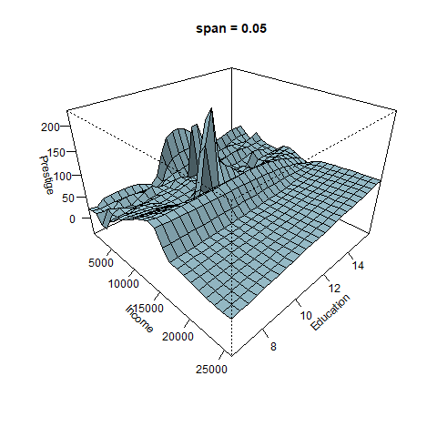

# Modelos polinomiales {#mod_poli}
En este capítulo se presenta una descripción breve de como ajustar modelos polinomiales con R.

## Modelos polinomiales de una o varias variables {-}
Cuando se construyen modelos para explicar la media de una variable respuesta $Y$, a veces no basta con incluir las covariables $X_1, \ldots, X_k$ sino que es necesario incluir potencias de esas variables para mejorar el modelo. En las siguientes secciones se muestra como incluir potencias de las covariables en un modelo.

```{block2, type='rmdnote'}
Al incluir en un modelo lineal una potencia de una variables $X$ el modelo sigue siendo lineal. El término lineal se refiere a los parámetros $\beta$ y no a las covariables.
```

## Funciones `I()` y `poly()` {-}
Las funciones `I()` y `poly()` son utilizadas para incluir elementos polinomiales en un modelo de regresión.

- Use `I()` para incluir un término específico en un modelo, por ejemplo, `I(x^3)` indica que queremos solo el término $x^3$.
- Use `poly()` para incluir __todos__ los términos de un polinomio hasta cierto grado, por ejemplo, `poly(x, degree=3)` indica que queremos incluir $x$, $x^2$ y $x^3$.

#### Ejemplo {-}
Como ilustración vamos a usar los datos del ejemplo 7.1 del libro de [Montgomery, Peck and Vining (2003)](https://www.amazon.com/Introduccion-analisis-regresion-lineal-Spanish/dp/9702403278). En el ejemplo 7.1 se busca crear un modelo que explique la resistencia a la tensión de una bolsa en función del porcentaje de madera dura.

A continuación se muestran los datos usados en el ejemplo.

```{r}
conc <- c(1, 1.5, 2, 3, 4, 4.5, 5, 5.5, 6, 6.5, 7, 8, 9, 10, 11, 12, 13, 14, 15)
resis <- c(6.3, 11.1, 20, 24, 26.1, 30, 33.8, 34, 38.1, 39.9, 42, 46.1, 53.1, 
           52, 52.5, 48, 42.8, 27.8, 21.9)
datos <- data.frame(concentracion=conc, resistencia=resis)
```

El siguiente código es usado para construir el diagrama de dispersión entre las variables resistencia y concentración.

```{r poly01, fig.height=3, fig.width=5, fig.align='center'}
library(ggplot2)
ggplot(datos, aes(x=concentracion, y=resistencia)) + 
  geom_point() + theme_light()
```

De este diagrama se ve claramente que hay una relación de tipo no lineal entre las variables. ¿Será mejor un modelo de grado 2 que un modelo de grado 1?

Vamos a ajustar ambos modelos y luego los comparamos, el elemento cuadrático lo vamos a crear usando la función `I()`.

```{r}
mod1 <- lm(resistencia ~ concentracion, data=datos)
mod2 <- lm(resistencia ~ concentracion + I(concentracion^2), data=datos)
```

Para hacer una comparación de ambos modelos vamos a agregar al diagrama de dispersión original la recta y la curva asociadas a los modelos `mod1` y `mod2` respectivamente.

```{r poly02, fig.height=3, fig.width=5, fig.align='center'}
ggplot(datos, aes(x=concentracion, y=resistencia)) + 
  geom_point() +
  geom_smooth(method='lm', formula=y~x, se=FALSE, col='dodgerblue1') +
  geom_smooth(method='lm', formula=y~x+I(x^2), se=FALSE, col='tomato') +
  theme_light()
```

De la figura anterior se observa claramente que el modelo lineal no es capaz de explicar los datos, se observan zonas donde el `mod1` siempre sub-estima y otras zonas donde siempre sobre-estima.

Vamos a comparar ahora los modelos por medio de un análisis de varianza, el código para hacer esto es el siguiente.

```{r}
anova(mod1, mod2)
```

El valor-P de la tabla anterior nos indica que es mejor `mod2`.

A continuación se analizan los residuales ($e_i$ vs $\hat{y}_i$) para ambos modelos.

```{r poly03, fig.height=3, fig.width=6.5, fig.align='center'}
par(mfrow=c(1, 2))
plot(mod1, which=1, caption='Modelo lineal')
plot(mod2, which=1, caption='Modelo cuadratico')
```

En la parte izquierda de la figura anterior se ve que para el modelo lineal `mod1` los residuales presentan una curvatura evidente, esto significa que falta un elemento de grado dos en la estructura del modelo `mod1`. Al lado derecho de la figura están los residuales para el modelo cuadrático, de esta figura se observa que los residuales son menores (en valor absoluto) que los residuales del `mod1` y que no presentan un patrón claro como en el caso anterior.

Otro punto a favor del modelo cuadrático es su $R^2_{Adj}$ que es de 0.897 frente al 0.265 del modelo lineal.

De lo anterior se concluye que es mejor el modelo cuadrático para explicar la resistencia en función de la concentración, el modelo ajustado está dado en la siguiente expresión.

\begin{align}
{Resi}_i &\sim N(\hat{\mu}_i, \sigma^2), \\ 
\hat{\mu}_i &= -6.674 + 11.764 \times Conc - 0.635 \times Conc^2, \\
\hat{\sigma} &= 4.42
\end{align}

## Modelos polinomiales con splines {-}
Los splines ofrecen una forma útil de ajustar un modelo cuando los datos se comportan en forma distinta en diferentes partes del rango de las $X´s$.

Los splines son polinomios de orden $k$ por segmentos y los puntos de unión se llaman nodos o knots. En la siguiente figura se muestra un spline hecho de un listón de madera y con nodos de hierro para lograr una curvatura deseada.

<p align="center">
  
</p>

Un spline cúbico básico con $h$ nodos en los puntos $t_1, t_2, \ldots, t_h$ se puede escribir como:

$$
E(Y) = \sum_{j=0}^{3} \beta_{0j} x^j + \sum_{i=1}^{h} \beta_{i} (x-t_i)^3_{+}
$$

donde

$$
(x-t_i)^3_+ = \begin{cases} 
(x-t_i)^3 &\mbox{if } x > t_i \\
0 & \mbox{if } x \leq t_i 
\end{cases}
$$

### Ejemplo {-}
Como ilustración vamos a usar los datos del ejemplo 7.2 del libro de @mpv06. En el ejemplo 7.2 se busca crear un modelo que explique la caída de voltaje en función del tiempo por medio dos modelos:

- un modelo polinomial de grado tres.
- un spline cúbico con dos nodos en $t=6.5$ y $t=13$.

Los datos utilizados en el ejemplo se muestran a continuación.

```{r}
drop <- c(8.33, 8.23, 7.17, 7.14, 7.31, 7.60, 7.94, 8.30, 8.76, 8.71, 9.71,
          10.26, 10.91, 11.67, 11.76, 12.81, 13.30, 13.88, 14.59,
          14.05, 14.48, 14.92, 14.37, 14.63, 15.18, 14.51, 14.34, 
          13.81, 13.79, 13.05, 13.04, 12.60, 12.05, 11.15, 11.15, 
          10.14, 10.08,9.78,9.80,9.95,9.51)
time <- seq(from=0, to=20, by=0.5)
datos <- data.frame(time=time, drop=drop)
```

Usando los datos anteriores podemos construir un diagrama de dispersión para entender la relación de las variables y la ubicación de los posibles nodos (sitios donde hay cambio de curvatura).

```{r poly04, fig.height=4, fig.width=5, fig.align='center'}
plot(datos, ylab="Voltage drop", xlab="Time (seconds)", pch=19, ylim=c(0, 15), las=1)
abline(v=6.5, lty="dotted", col='tomato')
abline(v=13, lty="dotted", col='tomato')
text(x=6.5, y=0.3, 't=6.5', col='tomato')
text(x=13, y=0.3, 't=13', col='tomato')
```

Primero vamos a ajustar el modelo polinomial cúbico, el codigo necesario es el siguiente.

```{r}
mod1 <- lm(drop ~ time + I(time^2) + I(time^3), data=datos)
summary(mod1)
```

De la anterior salida se pueden destacar los siguientes resultados:

- Los residuales varían entre -1.35 y 1.83.
- El $R^2_{Adj}=0.8673$.
- La estimación de $\sigma$ es 0.9335.
- El término $t^3$ es significativo en el modelo a un nivel de significancia del 5\%, eso implica que todos los términos de grado 2 y grado 1 __deben__ permanecer en el modelo, sean o no significativos.

Ahora vamos a ajustar el modelo spline cúbico con 2 nodos en $t=6.5$ y $t=13$, el codigo necesario es el siguiente.

```{r}
xplus <- function(x) ifelse(x >= 0, x, 0)  # Auxiliar function
time65 <- xplus(time - 6.5)               # New variable 1
time13 <- xplus(time - 13)                 # New variable 2
mod2 <- lm(drop ~ time + I(time^2) + I(time^3) + I(time65^3) + I(time13^3), data=datos)
summary(mod2)
```

De la anterior salida se pueden destacar los siguientes resultados:

- Los residuales están más cerca del cero cuando se comparan con los residuales del `mod1`.
- El $R^2_{Adj}=0.9891$ aumentó bastante.
- La estimación de $\sigma$ es 0.2678.
- Todos los términos son significativos.

Para hacer una comparación visual de ambos modelos vamos a construir nuevamente el diagrama de dispersión original y agregaremos las curvas ajustadas de ambos modelos. El código para hacer esto se muestra a continuación.

```{r poly05, fig.height=4, fig.width=5, fig.align='center'}
plot(datos, ylab="Voltage drop", xlab="Time (seconds)", pch=19, ylim=c(0, 15), las=1)
i <- order(time)
lines(time[i], fitted(mod1)[i], col=2, lwd=3)
lines(time[i], fitted(mod2)[i], col=4, lwd=3)
legend("bottomright", lwd=3, col=c(4,2), bty="n",
       legend=c("Cubic spline model", "Cubic polynomial model"))
```

Al observar la figura anterior se nota con claridad que el modelo cubic spline (azul) logra explicar mejor los datos, tanto en los extremos como en la parte central, eso significa que es mejor usar el modelo cubic spline para hacer predicciones futuras.

Usando la tabla de resumen obtenida con `summary(mod2)` se puede escribir el modelo cubic spline ajustado así:

\begin{align}
{Drop}_i &\sim N(\hat{\mu}_i, \hat{\sigma}^2), \\ 
\hat{\mu}_i &= 8.4657 -1.4531 t + 0.4899 t^2 -0.0295 t^3 + 0.0247 (t-6.5)^3_{+} + 0.0271 (t-13)^3_{+}, \\
\hat{\sigma} &= 0.2678
\end{align}

## Función `bs` {-}
La función `bs` del paquete `splines` se puede utilizar para incluir *basic splines* en un modelo de regresión, la estructura básica de la función se muestra a continuación.

```{r, eval=FALSE}
bs(x, df = NULL, knots = NULL, degree = 3, intercept = FALSE,
   Boundary.knots = range(x))
```

Los argumentos básicos de la función son:

- `x`: the predictor variable. Missing values are allowed.
- `df`: degrees of freedom.
- `knots`: the internal breakpoints that define the spline.
- `degree`: degree of the piecewise polynomial—default is 3 for cubic splines.

### Ejemplo {-}
En este ejemplo vamos a retomar el ejemplo 7.2 del libro de @mpv06 y que fue explicado anteriormente. El objetivo es repetir el modelo `mod2` pero con la ayuda de la función `bs`, a ese nuevo modelo lo vamos a llamar `mod3`. El código necesario se muestra a continuación.

```{r, message=FALSE}
require(splines)
mod3 <- lm(drop ~ bs(time, knots=c(6.5, 13), degree=3), data=datos)
summary(mod3)
```

Al comparar los resultados de `summary(mod2)` con `summary(mod3)` vemos sólo una pequeña coincidencia. ¿Serán iguales, similares o diferentes el `mod2` y `mod3`?

Para compararlos vamos a crear nuevamente el diagrama de dispersión original y vamos a agregar las curvas ajustadas para los tres modelos. El modelo `mod1` estará en color rojo, el modelo `mod2` en color azul y línea gruesa, y el modelo `mod3` en color naranja y línea delgada. a continuación el código usado.

```{r poly06, fig.height=4, fig.width=5, fig.align='center'}
plot(datos, ylab="Voltage drop", xlab="Time (seconds)", pch=19, ylim=c(0,15))
lines(time[i], fitted(mod1)[i], col='red', lwd=3)
lines(time[i], fitted(mod2)[i], col='blue', lwd=6)
lines(time[i], fitted(mod3)[i], col='orange', lwd=1)
legend("bottomright", lwd=c(3, 6, 2), col=c('red', 'blue', 'orange'),
       legend=c("Cubic polynomial model", 
                "Cubic spline manually",
                "Using bs()"), bty="n")
abline(v=c(6.5, 13), lty='dotted', col="tomato") # adding cutpoints
```

De la figura anterior se observa que el modelo `mod3` coincide con el modelo `mod2`. 

### Ejemplo {-}
Como ilustración vamos a usar los datos del ejemplo 3.1 del libro de @mpv06. En el ejemplo 3.1 los autores ajustaron un modelo de regresión lineal múltiple para explicar el __Tiempo__ necesario para que un trabajador haga el mantenimiento y surta una máquina dispensadora de refrescos en función de las variables __Número de Cajas__ y __Distancia__. 

El objetivo de este ejemplo es crear los siguientes modelos para compararlos con el MSE (mean squared error).

- modelo lineal con cantidad y distancia.
- modelo lineal con splines cúbicos de cantidad y distancia.

<p align="center">
  
</p>

__Solución__

Los datos del ejemplo están disponibles en el paquete **MPV**\index{MPV} (por los apellidos de los autores). A continuación el código para cargar los datos y una muestra de las 6 primeras observaciones de la base de datos, en total se disponen de 20 observaciones.

El siguiente código sirve para construir los dos modelos solicitados.

```{r}
library(MPV)
colnames(softdrink) <- c('tiempo', 'cantidad', 'distancia')

library(splines)

mod1 <- lm(tiempo ~ cantidad + distancia, data=softdrink)
mod2 <- lm(tiempo ~ bs(cantidad) + bs(distancia), data=softdrink)
```

Para obtener los valores del MSE con ambos modelos hacemos lo siguiente:

```{r}
y_true <- softdrink$tiempo
y_hat1 <- predict(mod1, newdata=softdrink)
y_hat2 <- predict(mod2, newdata=softdrink)

mse1 <- mean((y_true - y_hat1)^2)
mse2 <- mean((y_true - y_hat2)^2)
cbind(mse1, mse2)
```

De la salida anterior vemos que el MSE del modelo `mod2` que tiene splines cúbicos es menor (no necesariamente mejor) que el modelo `mod1`.

```{block2, type='rmdnote'}
El MSE en este ejemplo se pudo haber obtenido usando directamente los residuales.
```

```{block2, type='rmdwarning'}
¿Será que el modelo `mod2` está sobre parametrizado?
```

## Función `lowess`  {-}
La función `lowess` (LOcally WEighted Scatterplot Smoothing) permite constuir una curva suavizada a partir de muchas regresiones de orden __uno__ localizadas, usando una ventana que incluye un porcentaje `f` de puntos. A continuación se muestra una figura ilustrativa para entender lo que hace `lowess`.

<p align="center">
  
</p>

La estructura de la función `lowess` se muestra a continuación.

```{r, eval=FALSE}
lowess(x, y = NULL, f = 2/3, iter = 3, delta = 0.01 * diff(range(x)))
```

Los argumentos básicos de la función son:

- `x`: vector con los valores de la covariable.
- `y`: vector con los valores de la variable respuesta.
- `f`: porcentaje de puntos dentro de la ventana, por defecto es 2/3.

### Ejemplo  {-}
Como ejemplo vamos a usar los datos de la base `Prestige` que se encuentra en el paquete `car`. Queremos constuir un modelo lowess para explicar la variable `prestige` en función de la variable `income`. A continuación el código para crear el diagrama de dispersión que muestra la relación entre las variables.

```{r lowess1, fig.height=4, fig.width=5, fig.align='center', message=FALSE}
library(car)
plot(prestige ~ income, xlab="Average Income",
     ylab="Prestige", data=Prestige, pch=19)
```

Para crear el modelo lowess a los datos anteriores se usa el siguiente código.

```{r}
mod_lowess <- lowess(x=Prestige$income, y=Prestige$prestige, f=2/3)
```

El objeto `mod_lowess` es una lista con las coordenadas $x$ e $y$ por donde pasa la curva suavizada. A continuación el código para agregar la curva al diagrama de dispersión.

```{r lowess2, fig.height=4, fig.width=5, fig.align='center'}
plot(prestige ~ income, xlab="Average Income",
     ylab="Prestige", data=Prestige, pch=19)
lines(mod_lowess, lwd=4, col='tomato')
```

De la figura anterior vemos que la curva suavizada logra capturar el patrón de variación de los datos.

¿Qué sucede con la curva cuando cambiamos el parámetro `f`?

El efecto de `f` se puede ver con claridad en la siguiente figura. Cuando `f` es pequeño la curva es muy rugosa, para valores altos de `f` la curva se suaviza.

<p align="center">
  
</p>

## Función `loess`  {-}
La función `loess` (LOcally Estimated Scatterplot Smoothing) permite constuir una curva o superficie suavizada a partir de muchas regresiones de orden __uno__ o __dos__ localizadas, usando una ventana que incluye un porcentaje `span` de puntos. La función `loess` es una generalización de `lowess`.

La estructura de la función `loess` se muestra a continuación.

```{r, eval=FALSE}
loess(formula, data, weights, subset, na.action, model = FALSE,
      span = 0.75, enp.target, degree = 2,
      parametric = FALSE, drop.square = FALSE, normalize = TRUE,
      family = c("gaussian", "symmetric"),
      method = c("loess", "model.frame"),
      control = loess.control(...), ...)
```

Los argumentos básicos de la función son:

- `formula`: fórmula usual (`y ~ x1 + x2 + x3 + x4`) para indicar la variable respuesta y las covariables. Máximo se pueden incluir 4 covariables.
- `data`: marco de datos con las variables.
- `degree`: el grado de los polinomios locales a usar, se puede elegir entre grado 1 o grado 2.
- `span`: vector con los valores de la variable respuesta.

Los otros parámetros tienen valores por defecto que se pueden cambiar para obtener mejores ajustes.

### Ejemplo  {-}
Como ejemplo vamos a usar los datos de la base `Prestige` que se encuentra en el paquete `car`. Queremos constuir un modelo loess para explicar la variable `prestige` en función de las variables `income` y `education`. A continuación el código para crear el diagrama de dispersión que muestra la relación entre las variables.

```{r loess1, fig.height=4, fig.width=5, fig.align='center', message=FALSE}
library(plotly)
plot_ly(x=Prestige$income, 
        y=Prestige$education, 
        z=Prestige$prestige, type="scatter3d", color=Prestige$prestige) %>% 
  layout(scene = list(xaxis = list(title = 'Income'),
                      yaxis = list(title = 'Education'),
                      zaxis = list(title = 'Prestige')))
```

Para crear el modelo loess a los datos anteriores se usa el siguiente código.

```{r}
mod_loess <- loess(prestige ~ income + education, data=Prestige, 
              degree=2, span=0.75)
```

A continuación el código para agregar la superficie al diagrama de dispersión. Los objetos `inc` y `edu` son secuencias de valores en el rango de los datos originales. El objeto `newdata` es un marco de datos con todas las combinaciones de valores de `inc` y `edu`. El objeto `fit.prestige` es una matriz con los valores estimados de la variable prestige. Luego todos esos objetos entran a la función `plot_ly`.

```{r loess2, fig.height=4, fig.width=5, fig.align='center'}
inc <- with(Prestige, seq(min(income), max(income), len=25))
edu <- with(Prestige, seq(min(education), max(education), len=25))
newdata <- expand.grid(income=inc, education=edu)
fit.prestige <- matrix(predict(mod_loess, newdata), 25, 25)
plot_ly(x=inc, y=edu, z=fit.prestige) %>% add_surface() %>% 
  layout(scene = list(xaxis = list(title = 'Income'),
                      yaxis = list(title = 'Education'),
                      zaxis = list(title = 'Prestige')))
```

Es posible crear un gráfico con los puntos originales y la superficie del modelo, a continuación el código necesario.

```{r loess3, fig.height=4, fig.width=5, fig.align='center'}
library("plot3D")
scatter3D(x=Prestige$income,
          y=Prestige$education,
          z=Prestige$prestige, ticktype="detailed", pch=20, 
          bty="f", colkey=FALSE, phi=30, theta=45, type="h",
          xlab='Income',
          ylab='Education',
          zlab='Prestige',
          surf=list(x=inc, y=edu, z=fit.prestige,  
                    NAcol="black", shade=0.1))
```

¿Qué sucede con la superficie cuando cambiamos el parámetro `span`?

El efecto de `span` se puede ver con claridad en la siguiente figura. Cuando `span` es pequeño la superficie es muy rugosa, para valores altos de `span` la suferficie se suaviza.

<p align="center">
  
</p>

## Optimización con superficies de respuesta  {-}
Cuando se tiene una superficie de respuesta, obtenida por métodos paramétricos o no paramétricos, dos preguntas posibles son:

1. ¿Cuáles valores de las covariables __maximizan__ la variable respuesta?
2. ¿Cuáles valores de las covariables __minimizan__ la variable respuesta?

Ambos problemas se denominan problemas de optimización. Cuando se tiene una o dos covariables, el problema es sencillo, y se puede resolver dibujando la curva o la superficie, y visualmente se puede obtener el valor o valores de las $x'$s que optimizan la variable respuesta. Cuando se tienen tres o más covariables es necesario usar métodos de optimización, algunas de las funciones más usuales de R para hacer esto son:

1. función `nlminb`,
2. función `optim`.

### Función `nlminb`   {-}
La estructura de esta función es la siguiente:

```{r eval=FALSE}
nlminb(start, objective, gradient = NULL, hessian = NULL, ...,
       scale = 1, control = list(), lower = -Inf, upper = Inf)
```

Los parámetros de la función son:

- `start`: vector con los valores donde inicia la búsqueda.
- `objective`: función a MINIMIZAR. El primer argumento de esta función debe ser un vector y ella debe entregar un valor.
- `gradient`: función opcional que calcula el gradiente.
- `hessian`: función opcional que calcula la hessiana.
- `lower`: vector con los valores mínimos de la región de búsqueda.
- `upper`: vector con los valores máximos de la región de búsqueda.

```{block2, type='rmdtip'}
Maximizar la función $f(x)$ es equivalente a minimizar la función $-f(x)$. Esto es importante para hacer optimización.
```

### Ejemplo  {-}
Vamos a utilizar aquí unos datos de un experimento en el cual se estudió la influencia de la temperatura y la concentración sobre el rendimiento obtenido en un proceso químico. A continuación los datos del experimento.

```{r}
temp <- c(200, 250, 200, 250, 189.65, 260.35, 225, 225, 225, 225, 225, 225)
conc <- c(15, 15, 25, 25, 20, 20, 12.93, 27.07, 20, 20, 20, 20)
rend <- c(43, 78, 69, 73, 48, 76, 65, 74, 76, 79, 83, 81)
```

Vamos a construir un diagrama de dispersión para ver la relación de las variables.

```{r superficie1, fig.height=4, fig.width=5, fig.align='center'}
library(scatterplot3d)
scatterplot3d(x=temp, y=conc, z=rend, pch=16, cex.lab=1.5,
              highlight.3d=TRUE, type="h")
```

El objetivo es ajustar el siguiente modelo:

\begin{align}
y_i &\sim N(\mu_i, \sigma^2), \\ 
\mu_i &= \beta_0 + \beta_1 temp_{i} + \beta_2 conc_{i} + \beta_3 temp_i^2 + \beta_4 conc_i^2 + \beta_5 temp \times conc, \\
\sigma^2 &= \text{constante}
\end{align}

El código para ajustar el modelo es el siguiente.

```{r}
mod <- lm(rend ~ temp + conc + I(temp^2) + I(conc^2) + temp * conc)
```

Usando el modelo ajustado `mod` es posible dibujar la superfice de respuesta para determinar de forma visual los valores que maximizan el rendimiento.

```{r superficie2, fig.height=4, fig.width=5, fig.align='center'}
# Se crean 30 valores de las variables para crear la rejilla
Temperatura   <- seq(from=189.65, to=260.35, length.out=30)
Concentracion <- seq(from=12.93, to=27.07, length.out=30)
# Rend es la funcion a dibujar
Rend <- function(temp, conc) {
  res <- coef(mod) * c(1, temp, conc, temp^2, conc^2, temp * conc)
  sum(res)
}
Rend <- Vectorize(Rend) # La funcion a dibujar debe estar vectorizada
# La matriz Rendimiento con las alturas de la superficie se crea con outer
Rendimiento <- outer(Temperatura, Concentracion, Rend)
# Para dibujar la superficie de respuesta
persp(x=Temperatura, y=Concentracion, z=Rendimiento,
      theta=40, phi=30, ticktype = "detailed", col='salmon1')
```

Se puede también construir un gráfico con curvas de nivel para determinar de forma visual los valores que maximizan el rendimiento.

```{r superficie3, fig.height=4, fig.width=5, fig.align='center'}
contour(x=Temperatura, y=Concentracion, z=Rendimiento,
        nlevels=10, col=gray(0.3), lwd=2, lty='solid',
        xlab='Temperatura', ylab='Concentracion', las=1)
```

Un gráfico de calor es también útil para determinar de forma visual los valores que maximizan el rendimiento.

```{r superficie4, fig.height=4, fig.width=5, fig.align='center'}
filled.contour(x=Temperatura, y=Concentracion, z=Rendimiento,
               nlevels=10, xlab='Temperatura', ylab='Concentracion',
               las=1, color.palette = cm.colors)
```

Para encontrar los valores exactos que maximizan el rendimiento se usa la función `nlminb`. A continuación se crea la función `minus_rend` que representa $-f(x)$ la cual va a ser minimizada. Se define el punto de inicio de la búsqueda en el objeto `inicio` y luego el resultado de `nlminb` se almacena en el objeto `res`.

```{r}
minus_rend <- function(x) {
  temp <- x[1]
  conc <- x[2]
  new.data <- data.frame(temp=c(1, temp), conc=c(1, conc))
  -predict(mod, new.data)[2]
}
inicio <- c(192, 15)  # valores iniciales para la busqueda
names(inicio) <- c('Temperatura', 'Concentracion') # Colocando nombres
res <- nlminb(start=inicio, objective=minus_rend,
              lower=c(189.65, 12.93), # minimos de las variables
              upper=c(260.35, 27.07), # maximos de las variables
              control=list(trace=0))
res$par  # Valores optimos
-res$objective  # Valor del objetivo
```

```{block2, type='rmdwarning'}
Dentro del objeto res hay mucha más información. Es fundamental que el lector explore esos elementos con la ayuda de la función nlminb.
```

```{block2, type='rmdnote'}
Una reto interesante para el lector es que replique el ejemplo con la función optim para ver otra forma alternativa de optimizar.
```

## Polinomios ortogonales  {-}
Estamos preparando el contenido, revisar luego.


