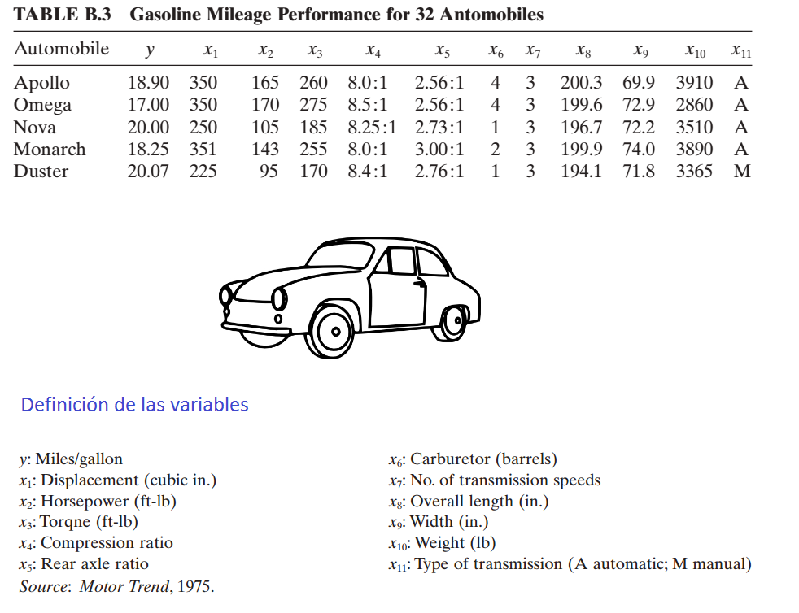

# Selección de variables {#selec}
En este capítulo se muestra como realizar selección de variables en un modelo de regresión lineal.

## Akaike Information Criterion ($AIC$) {-}
El $AIC$ se define como:

$$AIC = - 2 \times logLik + k \times n_{par},$$

donde $logLik$ corresponde al valor de log-verosimilitud del modelo para el vector de parámetros $\hat{\Theta}$, $k$ es un valor de penalización por el exceso de parámetros y $n_{par}$ corresponde al número de parámetros del modelo. 

Se debe recordar siempre que:

- El mejor modelo es aquel que $logLik$ ↑.
- El mejor modelo es aquel que $AIC$ ↓. 

Cuando el valor de penalización $k=\log(n)$ entonces el $AIC$ se llamada en $BIC$ o $SBC$ (Schwarz's Bayesian criterion).

## Funciones `logLik` y `AIC` {-}
La función `logLik` sirve para obtener el valor de log-verosimilitud de un modelo y la función `AIC` entrega el Akaike Information Criterion. La estructura de ambas funciones se muestra a continuación.

```{r eval=FALSE}
logLik(object)
AIC(object, k=2)
```

## Métodos {-}
Los métodos para realizar selcción de variables se pueden clasificar de la siguiente manera:

1. Todas las regresiones posibles.
2. Selección de variables.
    + Forward
    + Backward

A continuación una imagen ilustrativa para entender ambos métodos.

```{r selection01, echo=F, fig.cap='Ilustración de los métodos.', dpi=60, fig.align='center'}
knitr::include_graphics("images/forward_backward.png")
```

- Un término ingresa al modelo si su presencia disminuye el $AIC$.
- Un términa sale del modelo si su ausencia disminuye el $AIC$.

## Función `stepAIC` {-}
La función `stepAIC` del paquete **MASS** [@R-MASS] es útil para hacer selección de variables en un modelo de regresión. La estructura de la función se muestra a continuación.

```{r, eval=FALSE}
stepAIC(object, scope, scale = 0,
        direction = c("both", "backward", "forward"),
        trace = 1, keep = NULL, steps = 1000, use.start = FALSE,
        k = 2, ...)
```

Algunos de los argumentos son:

- `object`: un objeto con un modelo.
- `scope`: fórmula(s) con los límites de búsqueda.
- `direction`: los posibles valores son `both`, `backward`, `forward`.
- `trace`: valor lógico para indicar si se desea ver el paso a paso de la selección.
- `k`: valor de penalidad, por defecto es 2.

### Ejemplo {-}
En este ejemplo se busca encontrar un modelo de regresion lineal que explique la variable respuesta $y$ en función de las covariables $x_1$ a $x_{11}$, los datos provienen del ejercicio 9.5 del libro de [Montgomery, Peck and Vining (2003)](https://www.amazon.com/Introduccion-analisis-regresion-lineal-Spanish/dp/9702403278).

A continuación se muestra el encabezado de la base de datos y la definición de las variables.

```{r selection02, echo=F, fig.cap='Ilustración de la base de datos.', dpi=60, fig.align='center'}

```

__Nota__: Type of transmission (1=automatic, 0=manual).

__Solución__

Antes de iniciar es necesario revisar si hay `NA's` y eliminarlos.

```{r, message=F}
library(MPV)  # Aqui estan los datos
table.b3[22:26, ] # Can you see the missing values?
datos <- table.b3[-c(23, 25), ]
```

El objeto `datos` tiene la base de datos sin las líneas con `NA`, lo mismo se hubiese podido realizar usando la función `na.omit`.

### Aplicación del método __backward__ {-}
Vamos a crear un modelo _saturado_, es decir, el modelo mayor a considerar.

```{r}
full.model <- lm(y ~ ., data=datos)
summary(full.model)
```

De la tabla anterior se puede pensar en que hay un efecto de <span style="color:red">enmascaramiento</span> entre las variables ya que ninguna parece significativa marginalmente.

Se usa la función `stepAIC` y se elije `trace=TRUE` para obtener detalles del proceso de selección.

```{r, message=F}
library(MASS)  # Para poder usar la funcion stepAIC
modback <- stepAIC(full.model, trace=TRUE, direction="backward")
```

Para obtener un resumen del proceso se usa:

```{r}
modback$anova
```

Para ver la tabla de resultados del modelo `modback`.

```{r}
summary(modback)
```

### Aplicación del método __forward__ {-}
Para aplicar este metodo se debe crear un modelo vacío (`empty.model`) del cual iniciará el proceso. Es necesario definir un punto final de búsqueda, ese punto es una fórmula que en este caso llamaremos `horizonte`. A continuación el codigo.

```{r}
empty.model <- lm(y ~ 1, data=datos)
horizonte <- formula(y ~ x1 + x2 + x3 + x4 + x5 + x6 + x7 + x8 + x9 + x10 + x11)
```

Se usa la función `stepAIC` y se elije `trace=FALSE` para que NO se muestren los detalles del proceso de selección.

```{r, message=F}
modforw <- stepAIC(empty.model, trace=FALSE, direction="forward", scope=horizonte)
modforw$anova
```

Para ver la tabla de resultados del modelo `modforw`.

```{r}
summary(modforw)
```

Como la variable $x_4$ no es significativa, entonces se puede <span style="color:red">refinar</span> o actualizar el modelo `modforw` sacando $x_4$, esto se puede realizar fácilmente por medio de la función `update` así:

```{r}
modforw <- update(modforw, y ~ x1)
summary(modforw)
```

En este [enlace](https://www.researchgate.net/post/Why_stepAIC_gives_a_model_with_insignificant_variables_in_the_summarymodel2) usted podrá encontrar la respuesta que le dieron a Audrey al preguntar "Why stepAIC gives a model with insignificant variables?".

### Aplicación del método __both__  {-}
Para aplicar este método se debe crear un modelo vacío del cual iniciará el proceso. Es necesario definir un punto final de búsqueda, ese punto es una `formula` que en este caso llamaremos `horizonte`. A continuación el código.

```{r}
modboth <- stepAIC(empty.model, trace=FALSE, direction="both", scope=horizonte)
modboth$anova
```

El modelo `modboth` y `modforw` son el mismo.

A continuación vamos a realizar una comparación de los modelos obtenidos.

#### Comparando $R^2_{Adj}$  {-}
Para extraer el $R^2_{Adj}$ de la tabla de resultados se usa:
```{r}
summary(modback)$adj.r.squared
summary(modforw)$adj.r.squared
```

#### Comparando $\hat{\sigma}$  {-}
Para extraer el $\hat{\sigma}$ de la tabla de resultados se usa:
```{r}
summary(modback)$sigma
summary(modforw)$sigma
```

#### Comparando los residuales  {-}
```{r selection04, message=F, fig.asp=0.5, fig.width=8}
par(mfrow=c(1, 2))
plot(modback, main="Backward", pch=19, cex=1, which=1)
plot(modforw, main="Forward", pch=19, cex=1, which=1)
```

### Ejercicios {-}

1.	¿Qué patrón observa en los gráficos?
2.	Para cada uno de los dos modelos incluya términos cuadráticos con el objetivo de explicar ese patrón cuadrático no explicado y mostrado en los gráficos de residuales anteriores.

## Funciones `addterm` y `dropterm` {-}
Estas dos funciones pertenecen al paquete **MASS** [@R-MASS] y son útiles para agregar/quitar 1 variable con respecto al modelo ingresado. A continuación la estructura de las funciones.

```{r, eval=FALSE}
addterm(object, ...)
dropterm (object, ...)
```

### Ejemplo {-}
Usando datos anteriores ajuste un modelo para explicar `y` en función de `x2` y `x5`, luego use `addterm` para determinar cual de las variables `x1`, `x4` y `x6` se debería ingresar.

```{r}
mod1 <- lm(y ~ x2 + x5, data=datos)
maximo <- formula(~ x1 + x2 + x3 + x4 + x5 + x6)
addterm(mod1, scope=maximo)
```

De la salida anterior se ve que ingresar `x1` mejoraría el modelo porque lo llevaría de un $AIC=79.974$ a uno con $AIC=73.319$.

## Paquete **mixlm** {-}
El paquete **mixlm** creado por @R-mixlm contiene un buen número de funciones para modelación. Algunas de las funciones a destacar son `forward`, `backward`, `stepWise`.

```{block2, type='rmdwarning'}
Este paquete contiene otras funciones `lm` y `glm` que se pueden confundir con las funciones `lm` y `glm` del paquete **stats**. Por esta razón el usuario debe tener cuidado de usar la apropiada, en estos casos se recomienda usar `stats::lm(y ~ x)` o `mixlm::lm(y ~ x)` para obligar a R a que use la que el usuario desea.
```

### Ejemplo {-}
En este ejemplo se retoman los datos del ejercicio 9.5 del libro de [Montgomery, Peck and Vining (2003)](https://www.amazon.com/Introduccion-analisis-regresion-lineal-Spanish/dp/9702403278). En este ejemplo se busca encontrar un modelo de regresion lineal que explique la variable respuesta $y$ en función de las covariables $x_1$ a $x_{11}$, usando el modelo backward y que todas las variables sean significativas a un nivel del 4%.

Para realizar lo solicitado se usa el siguiente código:

```{r, message=FALSE}
library(MPV) # Aqui estan los datos
datos <- table.b3[-c(23, 25), ] # Eliminando 2 observaciones con NA
modelo <- lm(y ~ x1 + x2 + x3 + x4 + x5 + x6 + x7 + x8 + x9 + x10 + x11,
             data=datos)

library(mixlm)
backward(modelo, alpha=0.04)
```

De la salida anterior vemos que el modelo final es `y ~ x8 + x10`. Si comparamos este modelo con el obtenido al usar la función `stepAIC`, vemos que se eliminó la variable `x5` ya que su valor-P era 5.02%, superior al límite definido aquí del 4%.

## Paquete **leaps** {-}
El paquete **leaps** creado por @R-leaps está basado en [Fortran](https://es.wikipedia.org/wiki/Fortran) y es útil cuando nos interese encontrar subconjuntos de covariables para optimizar las características de un modelo.

La función `regsubsets` realiza una búsqueda exhaustiva de los mejores subconjuntos de variables $x$ para explicar $y$. La búsqueda utiliza un algoritmo eficiente de ramificación y unión.

La estructura de la función es la siguiente:

```{r, eval=FALSE}
regsubsets(x, data, nbest, nvmax, ...)
```

Algunos de los parámetros más usuados en la función son:

- `x`: fórmula usual.
- `data`: marco de datos.
- `nbest`: número de subconjuntos de cada tamaño a guardar.
- `nvmax`: máximo número de subconjuntos a evaluar.

### Ejemplo {-}
En este ejemplo vamos a usar la base de datos `mtcars` para encontrar los __dos__ mejores modelos con 1, 2, 3 y 4 covariables para explicar `mpg` en función de las variables `disp`, `hp`, `wt`, `qsec`.

Para hacer la búsqueda usamos el siguiente código. `nbest=2` porque queremos los mejores __dos__ modelos con cada número de covariables posible.

```{r}
library(leaps)
model_subset <- regsubsets(mpg ~ disp + hp + wt + qsec, 
                           data=mtcars, nbest=2, nvmax=13)
```

El `model_subset` es un objeto de la clase `regsubsets` y es posible usar la función S3 `summary` para objetos de esa clase. A continuación los elementos que componen `summary`.

```{r}
names(summary(model_subset))
```

El primer elemento del `summary` se obtiene así:

```{r}
summary(model_subset)$which
```

De las dos primeras líneas de la salida anterior se observa que los dos mejores modelos con __una__ sola covariable son `mpg ~ wt` y `mpg ~ disp`. De forma similar, los dos mejores modelos con __dos__ covariables son `mpg ~ hp + wt` y `mpg ~ wt + qsec`. De forma análoga se interpretan las líneas de la salida anterior.

Es posible mostrar gráficamente los resultados anteriores usando el método S3 `plot` para objetos de la clase `regsubsets`. A continuación la estructura de la función `plot`. El parámetro `scale` nos permite explorar los mejores modelos para cada uno de los cuatro criterios $BIC$, $C_p$, $R^2_{adj}$ y $R^2$. 

```{r, eval=FALSE}
plot(x, labels=obj$xnames, main=NULL, 
     scale=c("bic", "Cp", "adjr2", "r2"),
     col=gray(seq(0, 0.9, length = 10)),...)
```

A continuación el código para mostrar gráficamente los mejores modelos usando el criterio $R^2_{adj}$ y $BIC$.

```{r selection06, fig.height=6, fig.width=10}
par(mfrow=c(1, 2))
plot(model_subset, scale="adjr2", main=expression(R[Adj]^2))
plot(model_subset, scale="bic", main="BIC")
```

De la figura de la izquierda vemos que:

- El modelo con mayor $R^2_{adj}$ es `mpg ~ hp + wt + qsec`.
- El modelo `mpg ~ hp + wt` tiene igual $R^2_{adj}$ que `mpg ~ wt + qsec`.
- El mejor modelo con una sola covariable es `mpg ~ wt`.

La figura de la derecha se puede analizar de forma análoga.

Para obtener los valores exacto de $R^2_{adj}$ y $BIC$ mostrados en la figura anterior se usa el siguiente código.

```{r}
summary(model_subset)$adjr2
summary(model_subset)$bic
```

Para encontrar el modelo con el mejor $BIC$ se puede usar lo siguiente:
```{r}
which(summary(model_subset)$bic == min(summary(model_subset)$bic))
```

Para determinar la estructura del <span style="color:orange">modelo 3</span> identificado en la salida anterior usamos:

```{r}
summary(model_subset)$which[3, ]
```

## Funciones para el curso Estadística II {-}

El curso de Estadística II tiene las funciones especiales (`myStepwise` y `myBackward`) para realizar la selección de variables como se ha explicado en clase. 

La forma de usar las dos funciones para los tres métodos explicados en clase se muestra a continuación.

- Método forward: `myStepwise(full.model=full_mod, alpha.to.enter=alpha, alpha.to.leave=1)`.
- Método backward: `myBackward(base.full=mod, alpha.to.leave=alpha)`.
- Método both: `myStepwise(full.model=mod, alpha.to.enter=alpha, alpha.to.leave=alpha)`.

El objeto `full_mod` es el modelo saturado con todas los términos de interés. La cantidad `alpha` corresponde al nivel de significancia de las pruebas individuales de significancia. Sólo el método forward se fija `alpha.to.leave=1` para evitar la salida de alguna de las covariables que ingresó.

```{block2, type="rmdwarning"}
Para el método forward y both se usa la misma función `myStepwise`. Cuando queremos forward usamos dentro `alpha.to.leave=1` y cuando queremos both usamos `alpha.to.leave=alpha`.
```

Para accerder a estas funciones se corre el siguiente código:

```{r}
source("https://raw.githubusercontent.com/fhernanb/Trabajos_Est_2/main/Trabajo%201/funciones.R")
```

### Ejemplo {-}
En este ejemplo se busca encontrar un modelo de regresion lineal que explique la variable respuesta $y$ en función de las covariables $x_1$ a $x_{11}$, los datos provienen del ejercicio 9.5 del libro de [Montgomery, Peck and Vining (2003)](https://www.amazon.com/Introduccion-analisis-regresion-lineal-Spanish/dp/9702403278).

A continuación se muestra el encabezado de la base de datos y la definición de las variables.

```{r selectionEstII01, echo=F, fig.cap='Ilustración de la base de datos.', dpi=60, fig.align='center'}

```

__Nota__: Type of transmission (1=automatic, 0=manual).

Aplique los tres métodos de búsqueda vistos en clase usando $\alpha=0.05$ para las pruebas de hipótesis de individuales de significancia de las variables.

__Solución__

Antes de iniciar es necesario revisar si hay `NA's` y eliminarlos.

```{r, message=F}
library(MPV)  # Aqui estan los datos
table.b3[22:26, ] # Can you see the missing values?
datos <- table.b3[-c(23, 25), ]
```

El objeto `datos` tiene la base de datos sin las líneas con `NA`, lo mismo se hubiese podido realizar usando la función `na.omit`.

Ahora vamos a ajustar el modelo saturado, es decir, el modelo con todas las covariables.

```{r}
mod <- lm(y ~ ., data=datos)
```

Para aplicar el método <span style="color:red">Forward</span> visto en clase usamos la siguiente instrucción.

```{r eval=FALSE}
attach(datos)
mod_forward <- myStepwise(full.model=mod, alpha.to.enter=0.05, alpha.to.leave=1)
```

```
=====
Initial model without covariates

            Estimate Std. Error  t value     Pr(>|t|)
(Intercept) 20.03833   1.144254 17.51214 5.810909e-17

S = 6.267335, R-sq = 0.000000, R-sq(adj) = 0.000000, C-p = 81.412038
=====
+++ Adding x1 

               Estimate  Std. Error   t value     Pr(>|t|)
(Intercept) 33.49000993 1.535476457 21.810826 4.127754e-19
x1          -0.04702616 0.004984804 -9.433904 3.428631e-10

S = 3.120266, R-sq = 0.760681, R-sq(adj) = 0.752134, C-p = 0.184405
=====
```

Para ver un resumen del modelo resultante con Forward hacemos lo siguiente:

```{r eval=FALSE}
summary(mod_forward)
```

```
Residuals:
    Min      1Q  Median      3Q     Max 
-6.6063 -2.0276 -0.0457  1.4531  7.0213 

Coefficients:
             Estimate Std. Error t value Pr(>|t|)    
(Intercept) 33.490010   1.535476  21.811  < 2e-16 ***
x1          -0.047026   0.004985  -9.434 3.43e-10 ***
---
Signif. codes:  0 ‘***’ 0.001 ‘**’ 0.01 ‘*’ 0.05 ‘.’ 0.1 ‘ ’ 1

Residual standard error: 3.12 on 28 degrees of freedom
Multiple R-squared:  0.7607,	Adjusted R-squared:  0.7521 
F-statistic:    89 on 1 and 28 DF,  p-value: 3.429e-10

```

Para aplicar el método <span style="color:red">Backward</span> visto en clase usamos la siguiente instrucción.

```{r eval=FALSE}
mod_back <- myBackward(base.full=mod, alpha.to.leave=0.05)
```

```
-------------STEP  1 -------------
 The drop statistics : 
Single term deletions

Model:
y ~ x1 + x2 + x3 + x4 + x5 + x6 + x7 + x8 + x9 + x10 + x11
       Df Sum of Sq    RSS    AIC F value Pr(>F)  
<none>              187.40 78.962                 
x1      1    18.736 206.14 79.820  1.7996 0.1964  
x2      1     6.462 193.86 77.979  0.6207 0.4411  
x3      1    17.770 205.17 79.679  1.7069 0.2078  
x4      1     2.418 189.82 77.346  0.2323 0.6357  
x5      1    35.864 223.26 82.215  3.4447 0.0799 .
x6      1     0.632 188.03 77.063  0.0607 0.8082  
x7      1    11.065 198.47 78.683  1.0628 0.3162  
x8      1    20.047 207.45 80.011  1.9256 0.1822  
x9      1    15.758 203.16 79.384  1.5136 0.2344  
x10     1     7.836 195.24 78.190  0.7526 0.3971  
x11     1     0.465 187.87 77.036  0.0446 0.8350  
---
Signif. codes:  0 ‘***’ 0.001 ‘**’ 0.01 ‘*’ 0.05 ‘.’ 0.1 ‘ ’ 1

--------
Term dropped in step 1 : x11 
--------

-------------STEP  2 -------------
 The drop statistics : 
Single term deletions

Model:
y ~ x1 + x2 + x3 + x4 + x5 + x6 + x7 + x8 + x9 + x10
       Df Sum of Sq    RSS    AIC F value  Pr(>F)  
<none>              187.87 77.036                  
x1      1    18.280 206.15 77.822  1.8488 0.18985  
x2      1     6.642 194.51 76.078  0.6718 0.42259  
x3      1    17.815 205.68 77.754  1.8018 0.19532  
x4      1     2.363 190.23 75.411  0.2389 0.63057  
x5      1    36.370 224.24 80.345  3.6783 0.07028 .
x6      1     0.536 188.40 75.121  0.0542 0.81844  
x7      1    14.124 201.99 77.211  1.4285 0.24672  
x8      1    20.301 208.17 78.114  2.0531 0.16814  
x9      1    16.914 204.78 77.622  1.7106 0.20652  
x10     1     7.985 195.85 76.285  0.8076 0.38009  
---
Signif. codes:  0 ‘***’ 0.001 ‘**’ 0.01 ‘*’ 0.05 ‘.’ 0.1 ‘ ’ 1

--------
Term dropped in step 2 : x6 
--------
.
.
.
-------------STEP  10 -------------
 The drop statistics : 
Single term deletions

Model:
y ~ x8 + x10
       Df Sum of Sq    RSS    AIC F value    Pr(>F)    
<none>              260.14 70.800                      
x8      1    50.377 310.52 74.111  5.2286   0.03028 *  
x10     1   233.391 493.53 88.012 24.2239 3.758e-05 ***
---
Signif. codes:  0 ‘***’ 0.001 ‘**’ 0.01 ‘*’ 0.05 ‘.’ 0.1 ‘ ’ 1
```

Para ver un resumen del modelo resultante de Backward hacemos lo siguiente:

```{r eval=FALSE}
summary(mod_back)
```

```
Residuals:
   Min     1Q Median     3Q    Max 
-4.396 -2.040 -0.691  2.532  6.686 

Coefficients:
             Estimate Std. Error t value Pr(>|t|)    
(Intercept) 16.234963  10.914249   1.488   0.1485    
x8           0.212338   0.092861   2.287   0.0303 *  
x10         -0.010215   0.002075  -4.922 3.76e-05 ***
---
Signif. codes:  0 ‘***’ 0.001 ‘**’ 0.01 ‘*’ 0.05 ‘.’ 0.1 ‘ ’ 1

Residual standard error: 3.104 on 27 degrees of freedom
Multiple R-squared:  0.7716,	Adjusted R-squared:  0.7547 
F-statistic: 45.61 on 2 and 27 DF,  p-value: 2.196e-09
```

Para aplicar el método de selección <span style="color:red">en ambas direcciones</span> usamos la siguiente instrucción.

```{r eval=FALSE}
mod_both <- myStepwise(full.model=mod, alpha.to.enter=0.05, alpha.to.leave=0.05)
```

```
=====
Initial model without covariates

            Estimate Std. Error  t value     Pr(>|t|)
(Intercept) 20.03833   1.144254 17.51214 5.810909e-17

S = 6.267335, R-sq = 0.000000, R-sq(adj) = 0.000000, C-p = 81.412038
=====
+++ Adding x1 

               Estimate  Std. Error   t value     Pr(>|t|)
(Intercept) 33.49000993 1.535476457 21.810826 4.127754e-19
x1          -0.04702616 0.004984804 -9.433904 3.428631e-10

S = 3.120266, R-sq = 0.760681, R-sq(adj) = 0.752134, C-p = 0.184405
=====
```

