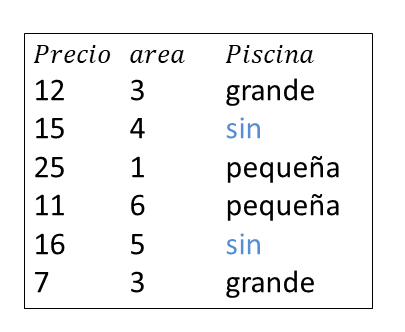

# ¿Cómo obtener la matriz $\boldsymbol{X}$ y el vector $\boldsymbol{y}$? {#xy}
En este corto capítulo se muestra cómo crear la matriz $\boldsymbol{X}$ y el vector $\boldsymbol{y}$ necesario para aplicar varios modelos predictivos.

Las funciones `model.matrix`, `model.frame` y `model.extract` son útiles para obtener la matriz $\boldsymbol{X}$ y el vector $\boldsymbol{y}$. A continuación se muestra un ejemplo ilustrativo.

## Ejemplo {-}
Usando la base de datos de abajo construya la matriz $\boldsymbol{X}$ y el vector $\boldsymbol{y}$ para crear un modelo de regresión que explique la variable `Precio` del apartamento en función del `Area` del apartamento y `Pisci`. Tome el nivel `Sin` de la variable `Pisci` como nivel de referencia.

<p align="center">
  
</p>

__Solución__

Lo primero es crear el marco de datos así:

```{r}
datos <- data.frame(Precio = c(12, 15, 25, 11, 16, 7),
                    Area = c(3, 4, 1, 6, 5, 3), 
                    Pisci = factor(x=c('Grande', 'Sin', 'Pequena', 'Pequena', 'Sin', 'Grande'),
                                   levels=c('Sin','Pequena','Grande')))
datos
```

Luego usamos la función `model.matrix` para obtener $\boldsymbol{X}$.

```{r}
form <- formula(Precio ~ Area + Pisci)
X <- model.matrix(object=form, data=datos)
X
```

Luego usamos las funciones `model.frame` y `model.extract` para obtener el vector $\boldsymbol{y}$.

```{r}
mf <- model.frame(Precio ~ Area + Pisci, data=datos)
y <- model.extract(mf, "response")
y
```

