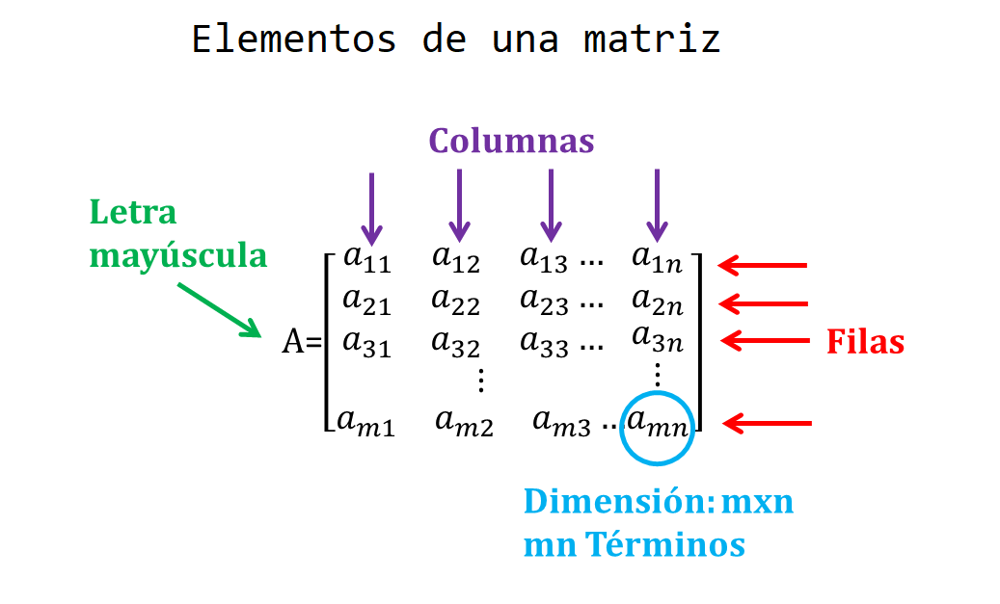

# Algebra matricial con R {#algmat}
En este capítulo se muestran algunas funciones útiles para álgebra lineal con R.

## Matrices {-}
Una matriz es un arreglo bidimensional (filas y columna) de números. 

<p align="center">
  
</p>

La función para crear una matriz es `matrix`. A continuación se muestran los argumentos de la función.

```{r eval=FALSE}
matrix(data=NA, nrow=1, ncol=1, byrow=FALSE, dimnames=NULL)
```

### Ejemplo {-}
Crear en R la matriz $M$ siguiente.

$$
M = \begin{pmatrix}
1 & 2  \\
1 & 5  
\end{pmatrix}
$$

__Solución__

Para crear la matriz podemos usar el siguiente código.

```{r}
M <- matrix(c(1, 2,
              1, 5), nrow=2, byrow=TRUE)
M
```

## Operaciones básicas sobre una matriz {-}
En la siguiente tabla se listan algunas de las funciones que se pueden utilizar sobre matrices. Los objetos `A` y `B` son matrices mientras que los objetos `x` y `b` son vectores.

Operador  | Descripción
------------- | -------------
`A * B`	  | Element-wise multiplication
`A %*% B`	| Matrix multiplication
`A %o% B`	| Outer product. $AB^\top$.
`t(A)`	  | Transpose
`diag(x)`	| Creates diagonal matrix with elements of x in the principal diagonal
`diag(A)`	| Returns a vector containing the elements of the principal diagonal
`diag(k)`	| If `k` is a scalar, this creates a $k \times k$ identity matrix. Go figure.
`solve(A, b)`	| Returns vector x in the equation b = Ax (i.e., A-1b)
`solve(A)`	| Inverse of A where A is a square matrix.
`ginv(A)`	| Moore-Penrose Generalized Inverse of A.
`ginv(A)`	| requires loading the MASS package.
`cbind(A,B,...)`	| Combine matrices(vectors) horizontally. Returns a matrix.
`rbind(A,B,...)`	| Combine matrices(vectors) vertically. Returns a matrix.
`rowMeans(A)`	| Returns vector of row means.
`rowSums(A)`	| Returns vector of row sums.
`colMeans(A)`	| Returns vector of column means.
`colSums(A)`	| Returns vector of column sums.

## Rango de una matriz {-}
El rango de una matriz es el número máximo de columnas (filas respectivamente) que son linealmente independientes.

### Ejemplo {-}
Calcular el rango de la matriz $M$ siguiente.

$$
M = \begin{pmatrix}
1 & 2 & 5 \\
1 & 5 & 2 \\
1 & 4 & 7
\end{pmatrix}
$$

__Solución__

Lo primero es crear la matriz $M$.

```{r}
M <- matrix(c(1, 2, 5,
              1, 5, 2,
              1, 4, 7), ncol=3, byrow=TRUE)
M
```

Una forma de obtener el rango es por medio de la función `qr` que hace una [descomposición QR](https://en.wikipedia.org/wiki/QR_decomposition) de la matriz.

```{r}
qr(M)$rank
```

De la salida anterior vemos que el rango de $M$ es 3, eso quiere decir que el número máximo de columnas linealmente independientes es 3.

Otra forma para obtener el rango de la matriz es por medio de la función `rankMatrix` del paquete **Matrix** [@R-Matrix] así:

```{r}
library(Matrix)
rankMatrix(M)[1]
```


### Ejemplo {-}
Calcular el rango de la matriz $N$ siguiente.

$$
N = \begin{pmatrix}
1 & 2 & 3 \\
1 & 5 & 6 \\
1 & 7 & 8
\end{pmatrix}
$$

__Solución__

Lo primero es crear la matriz $N$.

```{r}
N <- matrix(c(1, 2, 3,
              1, 5, 6,
              1, 7, 8), ncol=3, byrow=TRUE)
N
```

Al mirar con calma las columnas de la matriz se observa un detalle, la tercera columna de $N$ se obtiene al sumar la primera y segunda columna de $N$, eso significa que la tercera columna es combinación lineal de las dos primeras. Vamos a calcular el rango de $N$.

```{r}
qr(N)$rank
```

El valor de 2 obtenido no nos sorprende porque ya habíamos detectado que la tercera columna es combinación lineal de las dos primeras.
